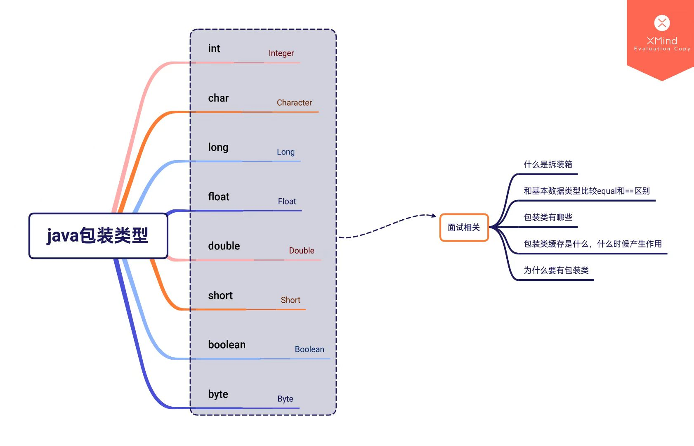

因为这一块不是很重要，所以只讲了Integer相关的包装类内容，一般包装都与之类似

下面是思维导图

### 什么是拆装箱

java的基本类型和引用类型之间的相互转换

### 和基本数据类型相比，equals和==的区别

> **包装类和包装类之间**
>
> ==是比较地址
>
> equals是比较值
>
> **包装类和基本数据类型之间**
>
> ==和equals比较的都是值
>
> **基本数据类型之间**
>
> ==比较值，没有equals方法

### Integer和int的区别

> - Integer是int的包装类；int是基本数据类型；
> - Integer变量必须实例化后才能使用；int变量不需要；
> - Integer实际是对象的引用，指向此new的Integer对象；int是直接存储数据值 ；
> - Integer的默认值是null；int的默认值是0；
> - Integer之间的==是地址的比较，equals是值的比较。
>

### Integer自动装箱底层用了什么

> 实际上使用的是Integer.valueOf()，将int值可以转换为Integer

### 包装类的缓存是什么，哪些包装类有

> **包装类的缓存设计，又称为享元设计**：
>
> 就是创建一个缓存区（**有限定大小的**）来将重复使用的数据放进去，从而达到少占用内存空间的效果。
>
> Byte (缓存范围：[-128,127])
> Short (缓存范围：[-128,127])
> Long (缓存范围：[-128,127])
> Integer (缓存范围：[-128,127])
> Character (缓存范围：[0,127])
> Boolean (全部缓存)
> Float (没有缓存)
> Doulbe (没有缓存)
>
> **但是要注意一个点**，只有运用了**类似于**Integer.valueOf()方法才会去走缓存

### 为什么要有包装类

> 将基本数据类型转变为对象，对象的功能更加强大，方便我们去对数据进行处理
