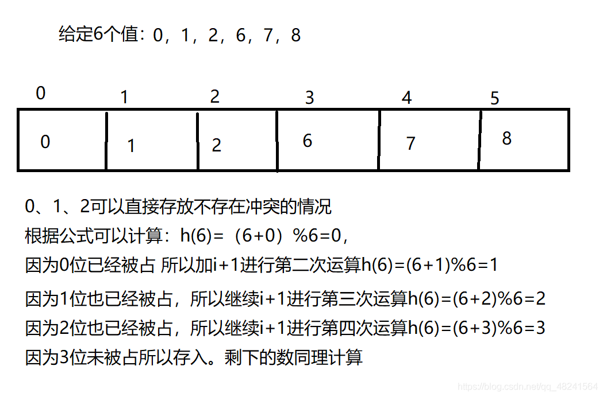
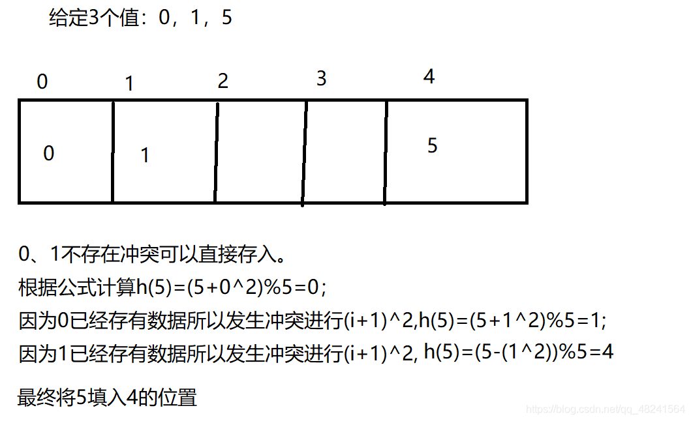
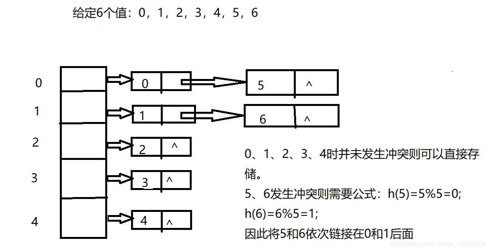

### HashMap的底层数据结构？

> 不用说，数组+链表和红黑树

### HashMap的存取原理？

> ①、对HahMap的Key调用hashCode()方法，返回int值，即对应的hashCode
>
> ②、把此hashCode作为哈希表的索引，查找哈希表的相应位置，若当前位置内容为NULL，则把hashMap的Key、Value包装成Entry数组，放入当前位置
>
> ③、若当前位置内容不为空，则继续查找当前索引处存放的链表，利用equals方法，找到Key相同的Entry数组，则用当前Value去替换旧的Value
>
> ④、若未找到与当前Key值相同的对象，则把当前位置的链表后移（Entry数组持有一个指向下一个元素的引用），把新的Entry数组放到链表表头

### Java7和Java8的区别？

> 头插法改成尾插法
>
> 为了解决多线程操作hashmap下的扩容导致的死循环问题

### 为啥会线程不安全？

> java8之前的死循环问题
>
> java8之后即使不会出现死循环，但是源码中put/get方法都没有同步加锁，即多线程下会出现一些问题，比如无法保证上一秒put的值，下一秒get的时候是原值，所以多线程下是不安全的。

### 有什么线程安全的类代替么?

> HashTable和ConcurrentHashMap

### 默认初始化大小是多少？为啥是这么多？为啥大小都是2的幂？

> 默认是16。
>
> 首先hashmap里面初始化的大小最好为2的幂次方
>
> 为什么呢，是因为在计算index的时候，公式是index=hashcode(key) & (Length-1)
>
> 都是2的幂次方可以保证length-1的二进制都为1，这样只要hashcode分布平均，hash算法的结果就是分布平均的。
>
> 所以目的就是为了实现分布平均

### HashMap的扩容方式？负载因子是多少？为什是这么多？

> 扩容方式就是创建一个Entry空数组，然后遍历原来的Entry，重新hash到数组。
>
> 负载因子是0.75
>
> 当负载因子是1.0的时候，意味着会出现大量的Hash的冲突，底层的红黑树变得异常复杂。对于查询效率极其不利。这种情况就是牺牲了时间来保证空间的利用率。
>
> 负载因子是0.5的时候，这也就意味着，当数组中的元素达到了一半就开始扩容，既然填充的元素少了，Hash冲突也会减少，那么底层的链表长度或者是红黑树的高度就会降低。查询效率就会增加。
>
> 综合看0.75比较合适。

### HashMap是怎么处理hash碰撞的？

> 用拉链法

### 为啥我们重写equals方法的时候需要重写hashCode方法呢？你能用HashMap给我举个例子么？

> 这个很好解释，equals比较的是对象的地址，有的时候我们需要比较的是对象里面的内容
>
> 就比如一个对象学生类，包含姓名和名字
>
> 然后我new了两个对象，内容都相同。因为我们重写了equals方法，所以两者equals相等
>
> 根据hashcode原则，两个对象相等，hashcode一定相等。但是在把这两个对象放入hashmap中时，由于默认hashcode方法是根据默认的内存地址计算而来的，所以不会相等，这就不符合hashcode原则了，所以我们要重写这个方法。

### 哈希冲突解决

> #### 1、开放定址法：我们在遇到哈希冲突时，去寻找一个新的空闲的哈希地址。
>
> 举例：就是当我们去教室上课，发现该位置已经存在人了，所以我们应该寻找新的位子坐下，这就是开放定址法的思路。如何寻找新的位置就通过以下几种方法实现。
>
> #### 1）线性探测法
>
> ​    当我们的所需要存放值的位置被占了，我们就往后面一直加1并对m取模直到存在一个空余的地址供我们存放值，取模是为了保证找到的位置在0~m-1的有效空间之中。
>
> 
>
> #### 2）平方探测法（二次探测）
>
> ​         当我们的所需要存放值的位置被占了，会前后寻找而不是单独方向的寻找。
>
> 
>
> #### 2、再哈希法：同时构造多个不同的哈希函数，等发生哈希冲突时就使用第二个、第三个……等其他的哈希函数计算地址，直到不发生冲突为止。虽然不易发生聚集，但是增加了计算时间。
>
> #### 3、链地址法：将所有哈希地址相同的记录都链接在同一链表中。
>
> 
>
> #### 4、建立公共溢出区：将哈希表分为基本表和溢出表，将发生冲突的都存放在溢出表中。