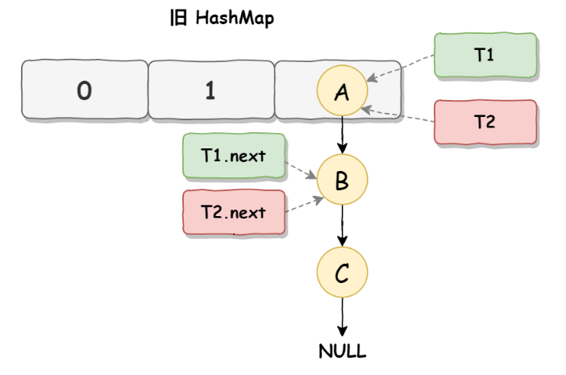
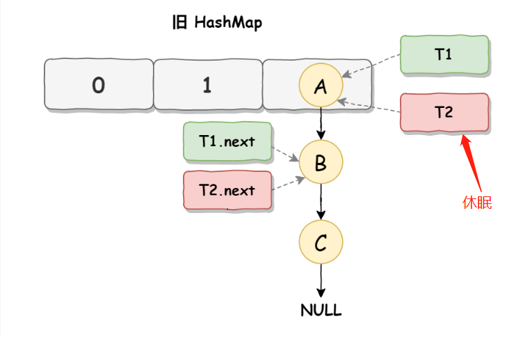
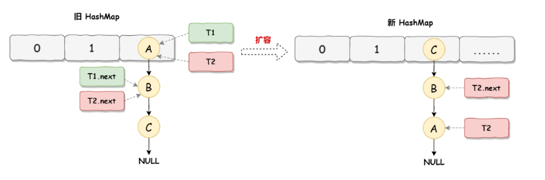
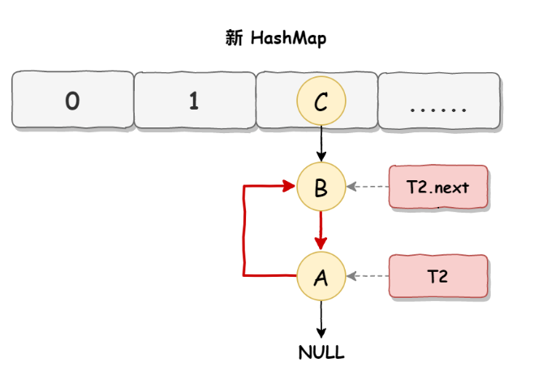

### ArrayList和LinkedList区别

> 这道题答案在网上可以看到很多，大多都大同小异，看来没什么坑点。
>
> - ArrayList底层数据结构是数组，LinkedList底层数据结构是双向链表
> - 对于随机index访问的get和set方法，ArrayList的速度要优于LinkedList。因为ArrayList直接通过数组下标找到元素，LinkedList要移动指针遍历每个元素直到找到为止。
> - 对于增加和删除，LinkedList速度更快，ArrayList在新增和删除元素时，会扩容和复制，并且要移动后面的元素。LinkedList只需要修改指针。

### HashMap和ConCurrentHashMap的区别

> ConcurrentHashMap主要在HashMap的基础上提供了并发安全的实现。
>
> **首先整体架构上讲**
>
> ConcurrentHashMap在1.8版本中与HashMap中几乎类似。使用的是Node数组+链表/红黑树结构
>
> 在1.7中，是间接实现HashMap的。
>
> 首先有一个Segment（默认是16）数组，然后每个Segment对应了一个类似于HashMap的结构。但是是没有红黑树结构的。
>
> **从并发安全实现上讲**
>
> 1.7主要是利用segment分段锁的机制来实现的，因为segment继承了ReentrantLock进行加锁，保证了每个Segment的线程安全。
>
> 1.8相对于1.7版本而言，ConcurrentHashMap使用了synchronized和cas来实现。这个版本锁的粒度更小，从锁segment转变为锁某个节点
>
> **从性能优化角度**
>
> 1.8引入了红黑树的机制，降低数据查询的时间复杂度。（注意HashMap1.8开始也是有红黑树机制的，同时转树是数量>=8,转链表是<=6）
>
> 同时也引入了多线程并发扩容的实现。就是多个线程对原始数据进行分片，分片之后，每个线程去负责一个分片的数据迁移，从而整体提升扩容过程中的数据迁移的一个效率

### 为什么HashMap是线程不安全的

> 在1.7版本的时候HashMap采用**头插法**，在多线程的情况下，当HashMap需要扩容的时候会出现数据丢失和造成死循环（生成环形链）
>
> 死循环流程图
>
> 
>
> 
>
> 
>
> 
>
> 在1.8版本的时候HashMap改用了**尾插法**，在多线程的情况下，当HashMap put数据的时候可能会出现数据覆盖问题。比如：两个线程A，B同时put数据，这时候计算出的hashCode值相等，然后到了最后一步插入数据的时候，其中A线程让出了CPU的执行时间，B线程直接把数据存入到map里面。然后这时A线程获取到了CPU执行时间时，因为之前已经进行了hash碰撞了，就不会再次去进行hash碰撞处理hashCode值相同的情况。所以这个时候A线程直接覆盖B线程的数据，这样就导致了B线程的数据被覆盖了(这个情况是最好理解的)

