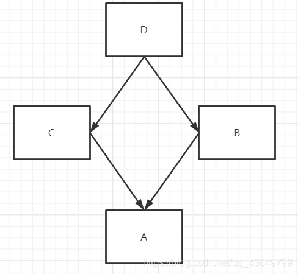

### 面向对象三大特征？着重说说"多态"

> *封装,继承,多态。*
>
> 关于多态性，根据我个人理解而言，不是属性的多态，而是方法的多态。
>
> 在java里面实现多态，必须实现:继承、重写、向上转型
>
> 满足这三个条件，我们才能使用统一的逻辑代码方法处理不同的对象，从而执行不同的行为。
>
> 在子类里面重写父类的方法以此来应对不同的对象，同时也可以对父类方法进行扩充，之后的修改也不会对其他代码产生影响。

### 菱形继承问题

> **菱形继承用通俗的话来说就是A继承B和C，B和C又继承于D。**
>
> 
>
> Java 中不存在菱形继承导致的问题，因为具有相同方法签名的两个方法会被合并成一个。

