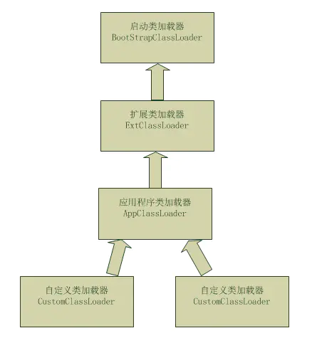
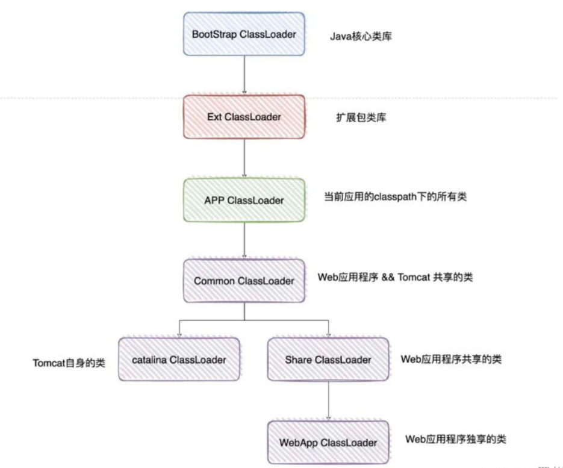

### 双亲委派机制是什么

> 首先Java编译器将Java源文件编译成.class文件，再由JVM加载.class文件到内存中，JVM装载完成后得到一个Class字节码对象。
>
> 那么，类的加载过程需要使用到加载器。而双亲委派机制指的就是当某个类加载器需要加载某个.class文件时，它首先把这个任务委托给他的上级类加载器，递归这个操作，如果上级的类加载器没有加载，自己才会去加载这个类。
>
> 我觉得好处主要就是
>
> - 避免了重复加载
> - 多了保护性，防止破坏核心库中的类
>
> 


### 能破坏双亲委派机制吗，怎么实现的，哪些案例实现了？（重写loadclass比较难）

> 当然可以
>
> ```markdown
> 如果不想打破双亲委派模型，就重写ClassLoader类中的findClass()方法即可，无法被父类加载器加载的类最终会通过这个方法被加载。
> 而如果想打破双亲委派模型则需要重写ClassLoader类loadClass()方法（当然其中的坑也不会少）。典型的打破双亲委派模型的框架和中间件有tomcat
> ```
>
> - **如何打破双亲委派机制：** 自定义ClassLoader类，重写loadClass方法（只要不依次往上交给父加载器进行加载，就算是打破双亲委派机制）
>
> 这边补充一下，为什么tomcat要打破双亲委派机制
>
> `子类加载器依旧可以使用父类加载器加载已经加载过的类，而父类加载器却无法使用子类加载器加载已经加载过的类`
>
> ```markdown
> 因为一个tomcat可以运行多个Web应用程序
> 
> 那假设我现在有两个Web应用程序，它们都有一个类，叫做User，并且它们的类全限定名都一样，比如都是com.yyy.User。但是他们的具体实现是不一样的
> 
> 那么Tomcat是如何保证它们是不会冲突的呢？
> 
> 答案就是，Tomcat给每个 Web 应用创建一个类加载器实例（WebAppClassLoader），该加载器重写了loadClass方法，优先加载当前应用目录下的类，如果当前找不到了，才一层一层往上找
> 
> 那这样就做到了Web应用层级的隔离
> ```
>
> 
>
> 如果考到了，这个真的难说。