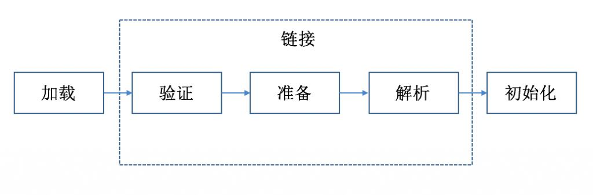

### 双亲委派机制是什么

> 首先Java编译器将Java源文件编译成.class文件，再由JVM加载.class文件到内存中，JVM装载完成后得到一个Class字节码对象。
>
> 那么，类的加载过程需要使用到加载器。而双亲委派机制指的就是当某个类加载器需要加载某个.class文件时，它首先把这个任务委托给他的上级类加载器，递归这个操作，如果上级的类加载器没有加载，自己才会去加载这个类。
>
> 我觉得好处主要就是
>
> - 避免了重复加载
> - 多了保护性，防止破坏核心库中的类
>
> 


### 能破坏双亲委派机制吗，怎么实现的，哪些案例实现了？（重写loadclass比较难）

> 当然可以
>
> ```markdown
> 如果不想打破双亲委派模型，就重写ClassLoader类中的findClass()方法即可，无法被父类加载器加载的类最终会通过这个方法被加载。
> 而如果想打破双亲委派模型则需要重写ClassLoader类loadClass()方法（当然其中的坑也不会少）。典型的打破双亲委派模型的框架和中间件有tomcat
> ```
>
> - **如何打破双亲委派机制：** 自定义ClassLoader类，重写loadClass方法（只要不依次往上交给父加载器进行加载，就算是打破双亲委派机制）
>
> 这边补充一下，为什么tomcat要打破双亲委派机制
>
> `子类加载器依旧可以使用父类加载器加载已经加载过的类，而父类加载器却无法使用子类加载器加载已经加载过的类`
>
> ```markdown
> 因为一个tomcat可以运行多个Web应用程序
> 
> 那假设我现在有两个Web应用程序，它们都有一个类，叫做User，并且它们的类全限定名都一样，比如都是com.yyy.User。但是他们的具体实现是不一样的
> 
> 那么Tomcat是如何保证它们是不会冲突的呢？
> 
> 答案就是，Tomcat给每个 Web 应用创建一个类加载器实例（WebAppClassLoader），该加载器重写了loadClass方法，优先加载当前应用目录下的类，如果当前找不到了，才一层一层往上找
> 
> 那这样就做到了Web应用层级的隔离
> ```
>
> 
>
> 如果考到了，这个真的难说。


### Java中的对象创建过程，类加载过程

> 1. 类加载
>    虚拟机遇到new指令，首先检查这个指令的参数能否在元空间的常量池中定位到一个类的符号引用，并且看这个符号引用的类是否已经被加载，链接和初始化。如果没有，那么在双亲委派模式下，查找对应的class文件。
>
>    
>
> 2. 分配内存
>    对象所需内存大小根据加载的类来确定，为对象分配内存也就是在堆内存中分配一块确定大小的内存。
>
>    如果内存规整，指针碰撞
>    如果内存不规整，虚拟机需要维护一个列表，则使用空闲列表
>
> 3. 处理并发安全问题
>    在分配内存空间时，另外一个问题时及时保证new对象的线程安全性，创建对象时非常频繁的操作，虚拟机需要解决并发问题。
>
>    CAS：失败重试，区域加锁，保证指针更新操作的原子性。
>    TLAB：线程本地缓冲区，**防止不同线程创建对象选择同一块儿内存区域而产生竞争**。
>
> 4. 初始化分配到的空间
>    内存分配结束，虚拟机将分配到的内存空间都初始化为零值。这一步保证了对象的实例字段在java代码中可以不用赋初始值就可以直接使用，程序能访问到这些字段的数据类型对应的零值。
>
> 5. 设置对象头
>    对象头包含两部分信息。第一部分是用于存储对象自身的运行时数据，如hashcode、GC分代年龄、锁状态标志、线程持有的锁等；第二部分是类型指针，指向它对应的类元数据，VM用这个确定其属于哪个类的实例。
>
> 6. 执行init方法
>    在java程序的视角看来，初始化才正式开始。执行init方法后，开始初始化成员变量，执行实例化代码块，调用类的构造方法，并把堆内对象的首地址赋值给引用变量。


### 对象在内存中存储布局

> **普通对象有三项**：对象头（Header）、实例数据（Instance Data）、对齐填充（Padding）。
>
> **数组对象**多了一个数组长度	
>
> 
> 
>
> 


### 对象头具体包括了什么

> 主要包含了klass pointer和markword
>
> klass pointer的存储内容是一个指针，指向了其类元数据的信息，jvm使用该指针来确定此对象是类的哪个实例.
>
> 
>
> 而markword主要结构为
>
> 
>
> 根据不同状态包含一些不同的信息，比如线程ID，分代年龄，hashcode，锁标志位等等。