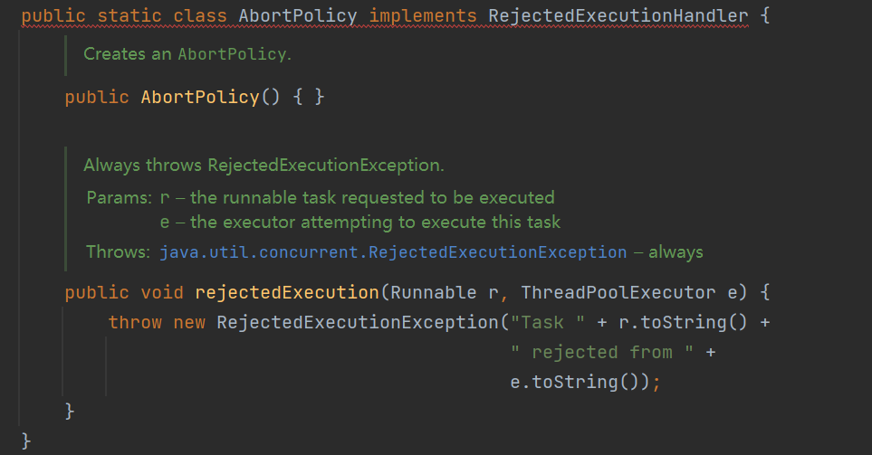

### 常用的线程池有哪些？工作流程是什么？拒绝策略有哪些？

> Java线程池类型有四种，分别为：newCachedThreadPool、newFixedThreadPool、newSingleThreadExecutor、newScheduleThreadPool。
>
> 1、newCachedThreadPool
>
> - 一个可缓存线程池，如果线程池长度超过处理所需，可灵活回收空闲线程，若线程数不够，则新建线程。
> - 适合短时间
> - 缺点：最大默认线程数位Integer.MAX_VALUE,会创建大量的线程导致OOM
>
> 2、newFixedThreadPool
>
> - 一个固定大小的线程池。可控制并发的线程数量，如果工作线程数量达到线程池初始的最大数，则将提交的任务存入到池队列中。
> - 缺点：该线程池使用的阻塞队列是LinkedBlockingQueue：链表阻塞队列，默认容量为Integer.MAX_VALUE，容量过大，可能会堆积大量的任务，从而造成OOM
>
> 3、newSingleThreadExecutor
>
> - 单线程的线程池，即只创建唯一的工作者线程来执行任务，，保证所有任务按照指定顺序执行。
> - 缺点：该线程池使用的阻塞队列是LinkedBlockingQueue：链表阻塞队列，默认容量为Integer.MAX_VALUE，容量过大，可能会堆积大量的任务，从而造成OOM
>
> 4、newScheduleThreadPool
>
> - 创建一个定长的线程池，支持定时及周期性任务执行。
> - 缺点:该线程池允许创建的最大线程数量为Integer.MAX_VALUE，可能会创建出大量线程，导致OOM
>
> 一般来说，都是根据具体情况自行创建。


### 线程池参数有哪些?

> ```
> public ThreadPoolExecutor(int corePoolSize,
>                         int maximumPoolSize,
>                         long keepAliveTime,
>                         TimeUnit unit,
>                         BlockingQueue<Runnable> workQueue,
>                         ThreadFactory threadFactory,
>                         RejectedExecutionHandler handler) {
>   if (corePoolSize < 0 ||
>       maximumPoolSize <= 0 ||
>       maximumPoolSize < corePoolSize ||
>       keepAliveTime < 0)
>       throw new IllegalArgumentException();
>   if (workQueue == null || threadFactory == null || handler == null)
>       throw new NullPointerException();
>   this.acc = System.getSecurityManager() == null ?
>           null :
>           AccessController.getContext();
>   this.corePoolSize = corePoolSize;
>   this.maximumPoolSize = maximumPoolSize;
>   this.workQueue = workQueue;
>   this.keepAliveTime = unit.toNanos(keepAliveTime);
>   this.threadFactory = threadFactory;
>   this.handler = handler;
> }
> ```
>
> 1. corePoolSize：线程池的核心线程数。核心线程会一直存活，即便没有任务需要执行，当线程数小于核心线程数时，即使有线程空闲，线程池也会优先创建新线程处理。设置allowCoreThreadTimeout=true（默认false）时，核心线程会超时关闭。
>
> 2. maximumPoolSize：线程池允许的最大线程数。当线程数>=corePoolSize，且任务队列已满时。线程池会创建新线程来处理任务。当线程数=maxPoolSize，且任务队列已满时，线程池会拒绝处理任务而抛出异常。
>
> 3. keepAliveTime：线程空闲时间。当线程空闲时间达到keepAliveTime时，线程会退出，直到线程数量=corePoolSize。如果allowCoreThreadTimeout=true，则会直到线程数量=0。
>
> 4. unit：keepAliveTime的时间单位。
>
> 5. workQueue：当核心线程数达到最大时，新任务会放在队列中排队等待执行。
>
> 6. threadFactory：线程工厂，ThreadFactory是一个接口，只有一个方法，即newThread(Runnable r)。从这个方法名字就可以知道，这接口是用来创建新的线程的。其使用也很简单，仅仅只需要实现newThread方法，根据自己的需要进行线程的创建即可。
>
> 7. handler：任务拒绝处理器。两种情况会拒绝处理任务：
>
>    1）、当线程数已经达到maxPoolSize，切队列已满，会拒绝新任务；
>
>    2）、当线程池被调用shutdown()后，会等待线程池里的任务执行完毕，再shutdown。如果在调用shutdown()和线程池真正shutdown之间提交任务，会拒绝新任务线程池会调用rejectedExecutionHandler来处理这个任务。如果没有设置默认是AbortPolicy，会抛出异常。


### 线程池工作流程

> 线程池内部是通过队列+线程实现的，当我们利用线程池执行任务时:
>
> 1.如果此时线程池中的线程数量小于corePoolSize，即使线程池中的线程都处于空闲状态，也要创建新的线程来处理被添加的任务。
>
> ⒉.如果此时线程池中的线程数量等于corePoolSize，但是缓冲队列workQueue未满，那么任务被放入缓冲队列。
>
> 3.如果此时线程池中的线程数量大于等于corePoolSize，缓冲队列workQueue满，并且线程池中的数量小于maximumPoolSize，建新的线程来处理被添加的任务。
>
> 4.如果此时线程池中的线程数量大于corePoolSize，缓冲队列workQueue满，并且线程池中的数量等于maximumPoolSize，那么通过 handler所指定的策略来处理此任务。
>
> 5.当线程池中的线程数量大于corePoolSize时，如果某线程空闲时间超过keepAliveTime，线程将被终止。这样，线程池可以动态的调整池中的线程数


### 线程池拒绝策略有哪些?

> 拒绝策略有如下几种：
>
> - AbortPolicy 丢弃任务，抛运行时异常。
> - CallerRunsPolicy 如果任务被拒绝了，则由调用线程（提交任务的线程）直接执行此任务
> - DiscardPolicy 丢弃任务，不抛出异常
> - DiscardOldestPolicy 从队列中踢出最先进入队列（最后一个执行）的任务，重新提交被拒绝的任务。


### 如何自定义拒绝策略？

> 打开源码发现
>
> 
>
> 官方的拒绝策略实现了RejectedExecutionHandler接口
>
> 也就意味着，我们要想实现自定义的拒绝策略，只需要实现RejectedExecutionHandler接口就可以。


### 线程池的线程数应该怎么配置呢？

> 首先要把任务分情况讨论，一种是IO密集型，另一种是CPU密集型
>
> IO密集型，主要任务都是跟网络通信，数据库链接相关，线程数需要大一些，一般是机器CPU核心数*2
>
> CPU密集型，主要任务都在用CPU跟内存，加密，逻辑操作业务处理等，一般推荐线程池不要过大，一般是CPU核心数 + 1，+1是因为可能存在页缺失(就是可能存在有些数据在硬盘中需要多来一个线程将数据读入内存)。如果线程池数太大，可能会频繁的 进行线程上下文切换跟任务调度。
>
> 不过这些是理论值，在实战中我们要根据实际情况去配置线程数。


### 线程池队列有哪几种？

> Java并发包中的阻塞队列一共7个
>
> **ArrayBlockingQueue：一个由数组结构组成的**有界阻塞队列。
>
> **LinkedBlockingQueue：一个由链表结构组成的无界阻塞队列。** 
>
> PriorityBlockingQueue：一个支持优先级排序的无界阻塞队列。 
>
> DealyQueue：一个使用优先级（启动时间）队列实现的无界阻塞队列。 
>
> **SynchronousQueue：一个不存储元素的阻塞队列。** 
>
> LinkedTransferQueue：一个由链表结构组成的无界阻塞队列。 
>
> LinkedBlockingDeque：一个由链表结构组成的双向阻塞队列。


### 线程池队列最常用的是哪个

> 面试的时候直接答
>
> **LinkedBlockingQueue**
>
> 默认是无界的，也就是Integer.MAX_VALUE。
>
> **LinkedBlockingQueue和ArrayBlockingQueue区别：**
>
> 1、LinkedBlockingQueue内部由两个ReentrantLock来实现出入队列的线程安全，由各自的Condition对象的await和signal来实现等待和唤醒功能。而ArrayBlockingQueue的只使用一个ReentrantLock管理进出队列。
>
> 而LinkedBlockingQueue实现的队列中的锁是分离的，其添加采用的是putLock，移除采用的则是takeLock，这样能大大提高队列的吞吐量，也意味着在高并发的情况下生产者和消费者可以并行地操作队列中的数据，以此来提高整个队列的并发性能。
>
> 2、队列大小有所不同，ArrayBlockingQueue是有界的初始化必须指定大小，而LinkedBlockingQueue可以是有界的也可以是无界的(Integer.MAX_VALUE)，对于后者而言，当添加速度大于移除速度时，在无界的情况下，可能会造成内存溢出等问题。
>
> 3、数据存储容器不同，ArrayBlockingQueue采用的是数组作为数据存储容器，而LinkedBlockingQueue采用的则是以Node节点作为连接对象的链表。
>
> 由于ArrayBlockingQueue采用的是数组的存储容器，因此在插入或删除元素时不会产生或销毁任何额外的对象实例，而LinkedBlockingQueue则会生成一个额外的Node对象。这可能在长时间内需要高效并发地处理大批量数据的时，对于GC可能存在较大影响。
>
> **SynchronousQueue**
>
> **没有容量**，是无缓冲等待队列，是一个不存储元素的阻塞队列，会直接将任务交给消费者，**必须等队列中的添加元素被消费后才能继续添加新的元素**,产生和消费一同运行。
>
> 使用SynchronousQueue阻塞队列一般要求maximumPoolSizes为无界，避免线程拒绝执行操作。