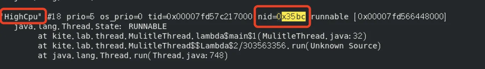

### Java程序占用 CPU 过高怎么排查

> ## 模拟一个高 CPU 场景
>
> 先用一段程序创建几个线程，将其中一个线程设置成高 CPU 使用率的。
>
> ```java
> public static void main(String[] args)  {
> for (int i = 0; i < 10; i++) {
> Thread thread = new Thread(() -> {
> System.out.println(Thread.currentThread().getName());
> try {
>   Thread.sleep(30 * 60 * 1000);
> }catch (Exception e){
>   e.printStackTrace();
> }
> });
> thread.setName("thread-" + i);
> thread.start();
> }
> 
> Thread highCpuThread = new Thread(() -> {
> int i = 0;
> while (true) {
> i++;
> }
> });
> highCpuThread.setName("HighCpu");
> highCpuThread.start();
> }
> ```
>
> ## 排查步骤
>
> ### 第一步，使用 top 找到占用 CPU 最高的 Java 进程
>
> 在真实环境中，首先要确认是不是 Java 程序造成的，如果有系统监控工具，可能会直接在预警信息里告诉你是有哪个进程造成的，但也有可能不知道，需要我们手动排查。
>
> 如果是在面试场景中，这个问题可能不需要确认，毕竟 Java 面试，面试官可能直接就告诉你是 Java 占用的 CPU 过高。
>
> 
>
> ### 第二步，用 `top -Hp` 命令查看占用 CPU 最高的线程
>
> 上一步用 `top`命令找到了那个 Java 进程。那一个进程中有那么多线程，不可能所有线程都一直占着 CPU 不放，这一步要做的就是揪出这个罪魁祸首，当然有可能不止一个。
>
> 执行`top -Hp pid`命令，pid 就是前面的 Java 进程，我这个例子中就是 `13731` ，完整命令为：
>
> `top -Hp 13731`，执行之后的效果如下
>
> 
>
> 可以看到占用 CPU 最高的那个线程 PID 为 `13756`。
>
> 然后将 `13756`转换为 16 进制的，后面会用到，可以用在线进制转换的网站直接转换，转换结果为 `0x35bc`
>
> ### 第三步，保存线程栈信息
>
> 当前 Java 程序的所有线程信息都可以通过 `jstack`命令查看，我们用`jstack`命令将第一步找到的 Java 进程的线程栈保存下来。
>
> ```text
> jstack 13731 > thread_stack.log
> ```
>
> ### 第四步，在线程栈中查找最贵祸首的线程
>
> 第二步已经找到了这个罪魁祸首的线程 PID，并把它转换成了 16 进制的，第三步保存下来的线程栈中有所有线程的 PID 16 进制信息，我们在线程栈中查找这个16进制的线程 id （`0x35bc`）。
>
> 

