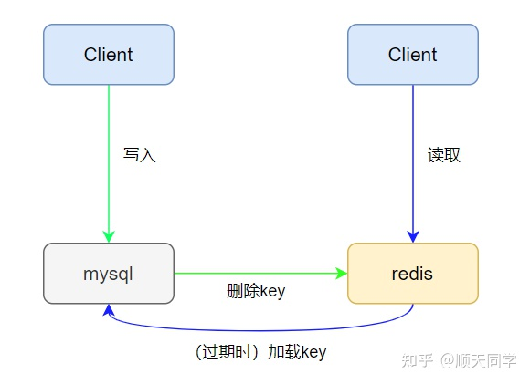

### Redis和数据库的交互策略

> ### 旁路缓存模式
>
> 一般我们都使用**Cache Aside**（旁路缓存）模式，这是更新缓存的一种常规策略。如下图所示，它分为读策略和写策略。
>
> **读策略** 从缓存中读取数据；如果缓存命中，则直接返回数据；如果缓存不命中，则从数据库中查询数据；查询到数据后，将数据写入到缓存中，并且返回给用户。
>
> **写策略** 更新数据库中的记录；删除缓存记录。
>
> 