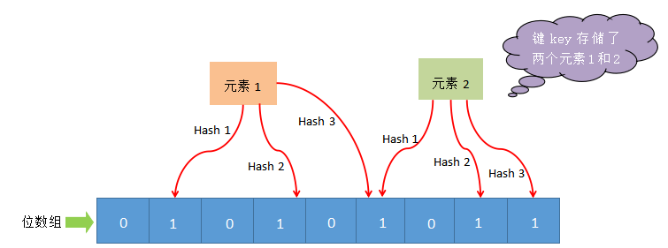
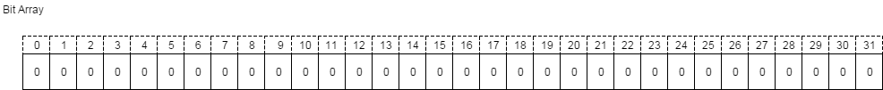
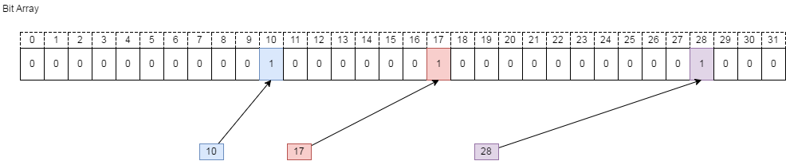
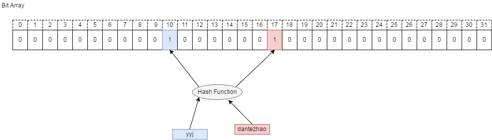

### 如何在海量数据中快速判断一个元素存不存在

> 用布隆过滤器。
>
> 我们用redis实现布隆过滤器
>
> 布隆过滤器是一个 bit 向量或者说 bit 数组
>
> 
>
> 比如我们假定一个8位向量，那么将元素1这个元素去进行多次哈希函数，然后得到数组位置后将该数组位置的值设定为1
>
> 那么接下来，我们要判断元素是否存在里面，同样，也进行多次哈希函数，然后给获取对应位置上的值，如果有一位为0，说明不存在。如果全为1，说明可能存在。

### bitmap底层实现原理

> BitMap 的基本原理就是用一个 bit 来标记某个元素对应的 Value，而 Key 即是该元素。由于采用一 个bit 来存储一个数据，因此可以大大的节省空间。
>
> 我们通过一个具体的例子来说明 BitMap 的原理，假设我们要对 0-31 内的 3 个元素 (10, 17,28) 排序，那么我们就可以采用 BitMap 方法（假设这些元素没有重复）。
>
> 如下图，要表示 32 个数，我们就只需要 32 个 bit（4Bytes），首先我们开辟 4Byte 的空间，将这些空间的所有 bit 位都置为 0。
>
> 
>
> 然后，我们要添加(10, 17,28) 这三个数到 BitMap 中，需要的操作就是在相应的位置上将0置为1即可。如下图，比如现在要插入 10 这个元素，只需要将蓝色的那一位变为1即可。
>
> 
>
> 将这些数据插入后，假设我们想对数据进行排序或者检索数据是否存在，就可以依次遍历这个数据结构，碰到位为 1 的情况，就当这个数据存在。
>
> ### 字符串映射
>
> BitMap 也可以用来表述字符串类型的数据，但是需要有一层Hash映射，如下图，通过一层映射关系，可以表述字符串是否存在。
>
> 
>
> 当然这种方式会有数据碰撞的问题，但可以通过 Bloom Filter 做一些优化。

