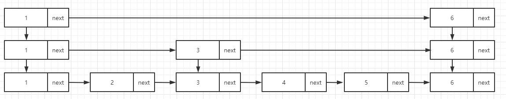
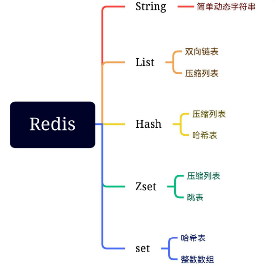
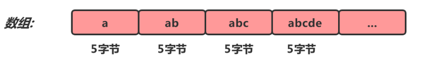
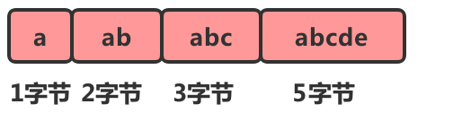
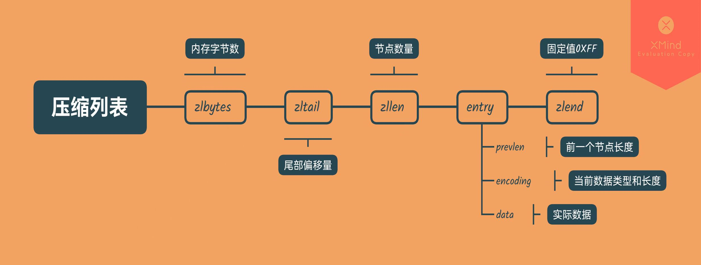
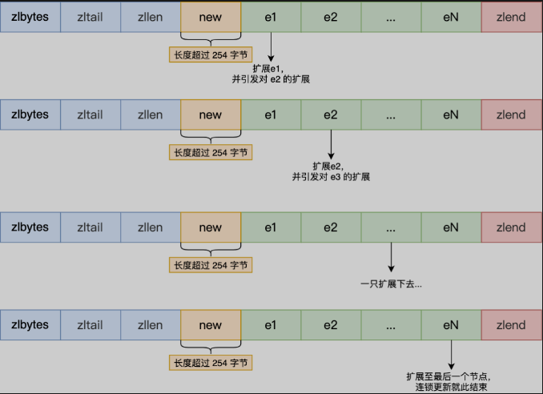

### Redis有哪些基本数据类型

> - String（字符串）
> - Hash（哈希）
> - List（列表）
> - Set（集合）
> - ZSet（Sorted Set 有序集合）
> - **高级数据类型：**
>   - HyperLogLog：用来做基数统计的算法，在输入元素的数量或体积非常大时，计算基数所需的空间总是固定的，并且是很小的。HyperLogLog 只会根据输入元素来计算基数，而不会存储输入元素本身
>   - Geo：用来地理位置的存储和计算
>   - BitMap：实际上不是特殊的存储结构，本质上是二进制字符串，可以进行位操作，常用于统计日活跃用户等,可以用来实现 **布隆过滤器（BloomFilter）**；


### Redis中ZSet的底层实现

> **使用了跳表和压缩列表**
>
> 如果问到，那么必问下一道题


### 跳表是什么，能介绍一下吗

> 跳表本质上是从单链表演化而来的，我们知道从单链表中找到数据，必须从头开始遍历，时间复杂度为O(n)
>
> 时间复杂度很高。所以我们可以建立一个索引，在原来链表的基础上，每两个结点提取一个结点建立索引，抽取出来的结点就是索引
>
> 
>
> 类似于上图所示，假设我们从单链表找6，我们会发现要遍历6个结点，但是从二级索引开始找，我们只需要遍历两个结点。大大提高查找效率。
>
> 插入，查找，删除的时间复杂度都是O(logn)


### 跳表如何维护平衡性

> 用“平衡函数”来维护,防止退化成单链表。
>
> 当我们在跳表中插入数据的时候，我们通过选择同时将这个数据插入到部分索引层中，如何选择索引层，可以通过一个随机函数来决定这个节点插入到哪几级索引中，比如随机生成了k，那么就将这个索引加入到，~~第一级到第k级索引~~中。
>
> 我觉得这个描述比较好
>
> **使用随机法，每插入一个新的节点，这个节点有 50% 的概率上升得到上级索引。这样时间复杂度就是 O(1) 了。**但是，新插入的节点不能无限上升。一般情况下，如果上升到最顶级索引后，如果随机化后仍要继续上升，就新增加一级索引，然后停止上升。
>
> 那其实是有两种随机函数了
>
> - 随机生成k，原始到k层索引，都插入该数据
> - 另一种是50%上升


### Redis的各数据底层结构是什么

> 


### 压缩列表是什么

> Redis 对象（List 对象、Hash对象、Zset 对象）包含的元素数量较少，或者元素值不大的情况才会使用压缩列表作为底层数据结构。
>
> 相较于数组的存储思路而言的。我们知道,**数组要求每个元素的大小相同,如果我们要存储不同长度的字符串,那我们就需要用最大长度的字符串大小作为元素的大小(假设是20个字节)。存储小于 20 个字节长度的字符串的时候，便会浪费部分存储空间**。
>
> 
>
> 数组的优势占用一片连续的空间可以很好的利用CPU缓存访问数据。如果我们想要保留这种优势，又想节省存储空间我们可以对数组进行压缩。
>
> 
>
> 所以我们添加多添加一个prevlen元素来存贮上一个节点的大小就可以方便的计算下一个节点的位置，如下图
>
> 
>
> 但是缺点也很明显，主要有两个：
>
> - 不能保存过多的元素，否则查询效率就会降低；
> - 新增或修改某个元素时，压缩列表占用的内存空间需要重新分配，甚至可能引发连锁更新的问题。
>
> **连锁更新主要会跟prevlen有关**
>
> prevlen 属性的空间大小跟前一个节点长度值有关，比如：
>
> - 如果**前一个节点的长度小于 254 字节**，那么 prevlen 属性需要用 **1 字节的空间**来保存这个长度值；
> - 如果**前一个节点的长度大于等于 254 字节**，那么 prevlen 属性需要用 **5 字节的空间**来保存这个长度值；
>
> 


### Redis一个字符串类型的值能存储最大容量是多少？

> 一个字符串类型键允许存储的数据的最大容量是512MB
>
> **在 Reids3.x 版本中`len`是使用int修饰的，这就会导致 buf 最长就是`2147483647`，无形中限制了字符串的最大长度。**


### Redis的SDS(简单动态字符串)

>  Redis 中的字符串不是简简单单的C语言中的字符串，是 SDS（Simple Dynamic String，简单动态字符串)
>
> 准确来说用一个sdshdr结构体
>
> 里面记录了一个char数组，和两个值，一个代表字符串长度，另一个代表buf中未使用的长度。
>
> ```c
> struct sdshdr {
>     //记录buf数组中已使用字节的数量
>     //等于SDS所保存字符串的长度
>     unsigned int len;
>     //记录buf数组中未使用字节的数量
>     unsigned int free;
>     //char数组，用于保存字符串
>     char buf[];
> };
> ```
>
> 优势:
>
> 字符串长度处理：Redis获取字符串长度，时间复杂度为O(1)，而C语言中，需要从头开始遍历，复杂度为O（n）;
>
> 空间预分配：字符串修改越频繁的话，内存分配越频繁，就会消耗性能，而SDS修改和空间扩充，会额外分配未使用的空间，减少性能损耗。
>
> 惰性空间释放：SDS 缩短时，不是回收多余的内存空间，而是free记录下多余的空间，后续有变更，直接使用free中记录的空间，减少分配。
>
> 自动扩容机制：当SDS API需要对SDS进行修改时，API会先检查 SDS 的空间是否满足修改所需的要求，如果不满足，API会自动将SDS的空间扩展至执行修改所需的大小，然后才执行实际的修改操作，所以使用 SDS 既不需要手动修改SDS的空间大小，也不会出现缓冲区溢出问题。 
>
> 二进制安全：Redis可以存储一些二进制数据，在C语言中字符串遇到'\0'会结束，而 SDS中标志字符串结束的是len属性。
>
> `通俗地讲，C语言中，用'0'表示字符串的结束，如果字符串本身就有'0'字符，字符串就会被截断，即非二进制安全；若通过某种机制，保证读写字符串时不损害其内容，则是二进制安全。`

