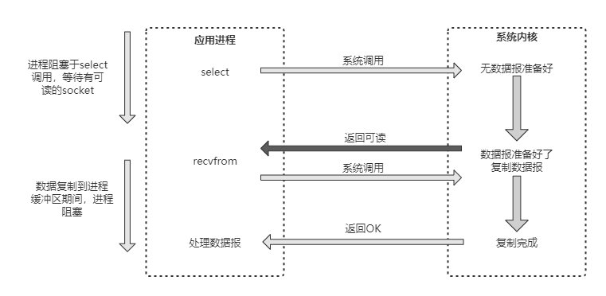

因为这个图太长了，所以这边只显示几个面试点，不常考


### 什么是 Redis

> Redis（Remote Dictionary Server）是一个开源的、键值对型的数据存储系统。基于内存也可持久化的日志型数据库，被广泛用于数据库、缓存和消息中间件。并且支持多种类型的数据结构，用于应对各种不同场景。支持事务，持久化，LUA 脚本以及多种集群方案等。


### Redis优缺点

> 优点:
>
> - 基于内存操作，性能高，读写快
> - 支持高并发，支持并发读写
> - 支持主从模式，支持读写分离
> - 有丰富的数据类型和特性
> - 支持持久化操作，不丢失数据
>
> 缺点:
>
> - 容量收到物理内存限制，不能实现海量数据的高性能读写
> - 相对于关系型数据库，不支持复杂逻辑查询，存储结构比较简单


### Redis为什么这么快

> 1. redis优化了数据结构，性能高
> 1. 完全基于内存操作
> 1. `Redis` 命令处理的核心模块为单线程，减少了锁竞争，以及频繁创建线程和销毁线程的代价，减少了线程上下文切换的消耗。
> 1. 使用非阻塞的 IO 多路复用机制；
> 1. 使用简单的自定义协议(RESP协议)


### 四种网络IO模型

> 为了解决网络IO中的问题，提出了4中网络IO模型：
>
> - 阻塞IO模型
> - 非阻塞IO模型
> - 多路复用IO模型
> - 异步IO模型
>
> #### 阻塞IO模型
>
> 在Linux中，默认情况下所有socket都是阻塞的，一个典型的读操作如下图所示：
>
> 
>
> 当应用进程调用了recvfrom这个系统调用后，系统内核就开始了IO的第一个阶段：准备数据。
>
> 对于网络IO来说，很多时候数据在一开始还没到达时(比如还没有收到一个完整的TCP包)，系统内核就要等待足够的数据到来。而在用户进程这边，整个进程会被阻塞。
>
> 当系统内核一直等到数据准备好了，它就会将数据从系统内核中拷贝到用户内存中，然后系统内核返回结果，用户进程才解除阻塞的状态，重新运行起来。所以，阻塞IO模型的特点就是在IO执行的两个阶段(等待数据和拷贝数据)都被阻塞了。
>
> #### 非阻塞IO模型
>
> 在Linux中，可以通过设置socket使IO变为非阻塞状态。当对一个非阻塞的socket执行read操作时，读操作流程如下图所示：
>
> 
>
> 从图中可以看出，当用户进程发出 read 操作时，如果内核中的数据还没有准备好，那么它不会阻塞用户进程，而是立刻返回一个错误。
>
> 从用户进程角度讲，它发起一个read操作后，并不需要等待，而是马上就得到了一个结果。当用户进程判断结果是一个错误时，它就知道数据还没有准备好，于是它可以再次发送read操作。
>
> 一旦内核中的数据准备好了，并且又再次收到了用户进程的系统调用，那么它马上就将数据复制到了用户内存中，然后返回正确的返回值。
>
> 所以，在非阻塞式IO中，用户进程其实需要不断地主动询问kernel数据是否准备好。非阻塞的接口相比阻塞型接口的显著差异在于被调用之后立即返回。
>
> #### 多路复用IO模型
>
> 多路IO复用，有时也称为事件驱动IO（Reactor设计模式）。它的基本原理就是有个函数会不断地轮询所负责的所有socket，当某个socket有数据到达了，就通知用户进程，多路IO复用模型的流程如图所示：
>
> 
>
> 当用户进程调用了select，那么整个进程会被阻塞，而同时，内核会"监视"所有select负责的socket，当任何一个socket中的数据准备好了，select就会返回。这个时候用户进程再调用read操作，将数据从内核拷贝到用户进程。
>
> 这个模型和阻塞IO的模型其实并没有太大的不同，事实上还更差一些。因为这里需要使用两个系统调用(select和recvfrom)，而阻塞IO只调用了一个系统调用(recvfrom)。但是，用select的优势在于它可以同时处理多个连接。所以，如果系统的连接数不是很高的话，使用select/epoll的web server不一定比使用多线程的阻塞IO的web server性能更好，可能延迟还更大；**select/epoll的优势并不是对单个连接能处理得更快，而是在于能处理更多的连接**。
>
> 如果select()发现某句柄捕捉到了"可读事件"，服务器程序应及时做recv()操作，并根据接收到的数据准备好待发送数据，并将对应的句柄值加入writefds，准备下一次的"可写事件"的select()检测。同样，如果select()发现某句柄捕捉到"可写事件"，则程序应及时做send()操作，并准备好下一次的"可读事件"检测准备。
>
> 如下图展示了基于事件驱动的工作模型，当不同的事件产生时handler将感应到并执行相应的事件，像一个多路开关似的。
>
> 
>
> IO多路复用是最常使用的IO模型，但是其异步程度还不够“彻底”，因为它使用了会阻塞线程的select系统调用。因此IO多路复用只能称为异步阻塞IO，而非真正的异步IO。
>
> #### 异步IO模型
>
> “真正”的异步IO需要操作系统更强的支持。如下展示了异步 IO 模型的运行流程(Proactor设计模式)：
> 
>
> 用户进程发起read操作之后，立刻就可以开始去做其他的事；而另一方面，从内核的角度，当它收到一个异步的read请求操作之后，首先会立刻返回，所以不会对用户进程产生任何阻塞。
>
> 然后，内核会等待数据准备完成，然后将数据拷贝到用户内存中，当这一切都完成之后，内核会给用户进程发送一个信号，返回read操作已完成的信息。
>
> #### IO模型总结
>
> 调用阻塞IO会一直阻塞住对应的进程直到操作完成，而非阻塞IO在内核还在准备数据的情况下会立刻返回。
>
> 两者的区别就在于同步IO进行IO操作时会阻塞进程。按照这个定义，之前所述的阻塞IO、非阻塞IO及多路IO复用都属于同步IO。实际上，真实的IO操作，就是例子中的recvfrom这个系统调用。
>
> 非阻塞IO在执行recvfrom这个系统调用的时候，如果内核的数据没有准备好，这时候不会阻塞进程。但是当内核中数据准备好时，recvfrom会将数据从内核拷贝到用户内存中，这个时候进程则被阻塞。
>
> 而异步IO则不一样，当进程发起IO操作之后，就直接返回，直到内核发送一个信号，告诉进程IO已完成，则在这整个过程中，进程完全没有被阻塞。
>
> 各个IO模型的比较如下图所示：
> 


### 能简单介绍下resp协议吗

> RESP 是redis客户端和服务端之间使用的一种通讯协议；
>
> RESP 的特点：实现简单、快速解析、可读性好
>
> 在 RESP 协议中，第一个字节决定了具体数据类型：
>
> 简单字符串：Simple Strings，第一个字节响应 +
> 错误：Errors，第一个字节响应 -
> 整型：Integers，第一个字节响应 :
> 批量字符串：Bulk Strings，第一个字节响应 $
> 数组：Arrays，第一个字节响应 *
>
> 我们来看看一具体的例子，我们一条正常指令 PSETEX test_redisson_batch_key8 120000 test_redisson_batch_key=>value:8，经 RESP 协议编码后长这样：
>
> ```markdown
> *4
> $6
> PSETEX
> $24
> test_redisson_batch_key8
> $6
> 120000
> $32
> test_redisson_batch_key=>value:8
> ```
