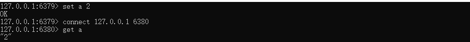
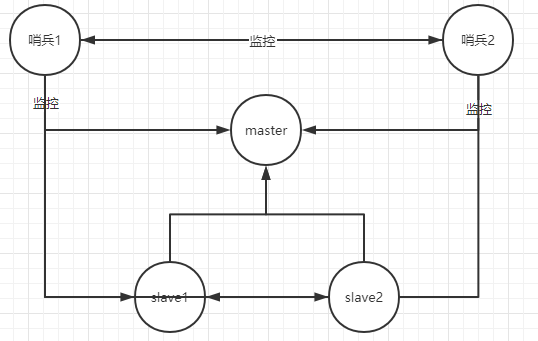
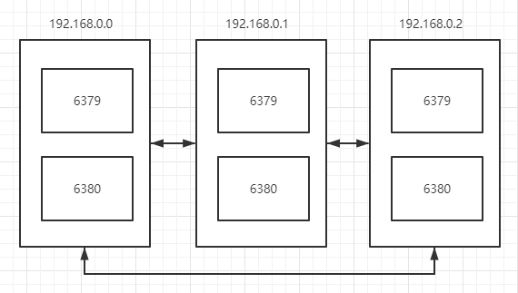

### Redis为什么需要集群

> - 首先集群解决单节点故障问题，提高系统的可用性
> - 提升并发作业能力


### Redis一般如何实现集群

> **方式1：Cluster**(面试时主要答这个)
>
> **这是Redis 自带的集群功能**，它采用的分布式算法是**哈希槽**，而不是一致性Hash。支持主从结构，可以扩展多个从服务器，当主节点挂了可以很快切换到一个从节点作主节点，然后其他从节点都会切换读取最新的主节点。
>
> **方式2：Twemproxy**
>
> Twitter 开源的一个轻量级后端代理。可以管理 Redis 或 Memcache 集群。相对于 Redis 集群来说，易于管理。它的使用方法和Redis集群没有任何区别，只需要设置多个Redis实例后，在本需要连接 Redis 的地方改为连接 Twemproxy ，它就会以一个代理的身份接收请求并使用一致性Hash算法，将请求连接到具体的Redis节点上，将结果再返回Twemproxy。对于客户端来说，Twemproxy 相当于是缓存数据库的总入口，它不需要知道后端如何部署的。Twemproxy 会检测与每个节点的连接是否正常，如果存在异常节点就会将其剔除，等一段时间后，Twemproxy 还会再次尝试连接被剔除的节点。
>
> **方式3：Codis**
>
> 它是一个 Redis 分布式的解决方法，对于应用使用 Codis Proxy 的连接和使用Redis的服务没有明显区别，应用能够像使用单机 Redis 一样，让 Codis 底层处理请求转发，实现不停机实现数据迁移等工作。


### Redis集群的三种模式

> **主从模式**：master 节点挂掉后，需要手动指定新的 master，可用性不高，基本不用。
>
> **哨兵模式**：master 节点挂掉后，哨兵进程会主动选举新的 master，可用性高，但是每个节点存储的数据是一样的，浪费内存空间。数据量不是很多，集群规模不是很大，需要自动容错容灾的时候使用。
>
> **Redis cluster**：主要是针对海量数据+高并发+高可用的场景，如果是海量数据，如果你的数据量很大，那么建议就用Redis cluster，所有主节点的容量总和就是Redis cluster可缓存的数据容量。
>
> 上次的面试官告诉我，实际业务中集群指的就是Redis cluster

#### 主从模式

设置很简单

```cmd
start redis-server.exe --port 6379 
start redis-server.exe --port 6380 --slaveof 127.0.0.1 6379 
这边显示了主要用slaveof这边来配置主从关系
```



为什么生产环境不用呢，因为master挂了之后，这个slave根本不会变成master结点。

#### 哨兵模式

针对主从模式的缺点，我们推行了哨兵模式

其实本质上很简单，在主从模式中我们添加了哨兵来监控主结点和从结点，如果master宕机，**则选择一个从结点当主节点**（这边使用了发布订阅模式）



#### Rediscluster模式（多主多从）

生产环境中一般都用这个模式

因为哨兵模式虽然解决了高可用和读写分离问题，但是每台redis服务都需要存储相同的服务，浪费内存，水平扩容不行。

**redis集群采用p2p模式，去中心化，不存在中心节点和代理节点**

**redis没有统一入口，客户端连接集群中的任意节点即可**

**redis cluster有这么一个投票容错机制：如果集群中找过半数的节点投票认为某节点挂了，那么该节点就挂了**

**redis集群至少需要3个主节点**：因为投票容错机制要求超过半数节点认为某节点挂了该节点才是挂了，所以2个节点服务构建集群。

**redis集群至少需要6台服务器**

- 因为要保证集群的高可用，需要每个主节点都有至少一个从节点（备份节点）
- 如果手上没那么多服务，也可以采用伪分布式集群搭法，即一台物理机启动多个redis实例




### Redis分片机制

> **(1)范围分片**
> 分片需要将不同key映射到不同Redis实例上存储，所以key的映射规则需要制定一个算法，最简单的一个分片方案应该是范围分片。范围分片理解起来很简单，比如我们存储用户基本信息，我们制定一个算法将用户user*id从0到1000映射到实例A，user*id从1000到2000映射到实例B，以此类推。这个方案很轻松可以使用，但是引发了一个问题：我们需要维护user_id范围和映射实例之间的关系。而正是这个问题导致范围分片虽然简单**，但是效率比其他分片方案低效许多，所以Redis中一般不会使用范围分片作为分片方案。**
>
> **(2)哈希分片**
> 比如我们目前有四个Redis实例，我们需要存储一个key。我们可以通过**哈希函数crc32()**将key名转换成一个长整型数字，然后对长整型数字对4**取余**，就可以得到映射的实例。**但是这种分配方案一样存在弊端：当我们需要增加或移除Redis实例时，就会造成大量key无法被命中。所以这时候出现了一种哈希分片的高级形式--一致性哈希。**
>
> **一致性哈希有三大特性：**
>
> - key哈希结果尽可能分配到不同Redis实例。
> - 当实例增加或移除，需要保护已映射的内容不会重新被分配到新实例上。
> - 对key的哈希应尽量避免重复。
>
> **但是在Redis中没有使用一致性哈希这个概念，而是引入了哈希槽。**在Redis集群中共有**16384个哈希槽**，**然后每个key通过哈希函数crc16()将key名转化成一个长整型数字再对16384取余，最终决定这个key存储的哈希槽。**而每个Redis实例负责维护一部分哈希槽，所有实例共同维护所有的哈希槽。使用哈希槽最显而易见的特点就是Redis实例的增加或者移除很方便，而不需要暂停所有Redis实例服务。
>
> 
>
> **数据分片方式一般有三种：客户端分片、代理分片和服务器分片。**
>
> **1）客户端分片**
> **定义：**客户端自己计算key需要映射到哪一个Redis实例。
> **优点：**客户端分片最明显的好处在于降低了集群的复杂度，而服务器之间没有任何关联性，数据分片由客户端来负责实现。
> **缺点：客户端实现分片则客户端需要知道当前集群下不同Redis实例的信息，当新增Redis实例时需要支持动态分片，多数Redis需要重启才能实现该功能。**
>
> 2）**代理分片**
> **定义：**客户端将请求发送到代理，代理通过计算得到需要映射的集群实例信息，然后将客户端的请求转发到对应的集群实例上，然后返回响应给客户端。
> **优点：**降低了客户端的复杂度，客户端不用关心后端Redis实例的状态信息。
> **缺点：**多了一个中间分发环节，所以对性能有些取的损失。
>
> 3）**服务器分片**
> **定义：**客户端可以和集群中任意Redis实例通信，当客户端访问某个实例时，服务器进行计算key应该映射到哪个具体的Redis实例中存储，如果映射的实例不是当前实例，则该实例主动引导客户端去对应实例对key进行操作。**这其实是一个重定向的过程。这个过程不是从当前Redis实例转发到对应的Redis实例，而是客户端收到服务器通知具体映射的Redis实例重定向到映射的实例中。当前还不能完全适用于生产环境。**
> **优点：**支持高可用，任意实例都有主从，主挂了从会自动接管。
> **缺点：**需要客户端语言实现服务器集群协议，但是目前大多数语言都有其客户端实现版本。
>
> **4）预分片**
> 从上面可以清楚地看出，分片机制增加或移除实例是非常麻烦的一件事，所以我们可以考虑一开始就开启32个节点实例，当我们可以新增Redis服务器时，我们可以将一半的节点移动到新的Redis服务器。这样我们只需要在新服务器启动一个空节点，然后移动数据，配置新节点为源节点的从节点，然后更新被移动节点的ip信息，然后向新服务器发送slaveof命令关闭主从配置，最后关闭旧服务器不需要使用的实例并且重新启动客户端。这样我们就可以在几乎不需要停机时间时完成数据的移动。
>
> **分片机制的缺点**
>
> - 分片是由多台Redis实例共同运转，所以如果其中一个Redis实例宕机，则整个分片都将无法使用，所以分片机制无法实现高可用。
> - 如果有不同的key映射到不同的Redis实例，这时候不能对这两个key做交集或者使用事务。
> - 使用分片机制因为涉及多实例，数据处理比较复杂。
> - 分片中对于实例的添加或删除会很复杂，不过可以使用预分片技术进行改善。