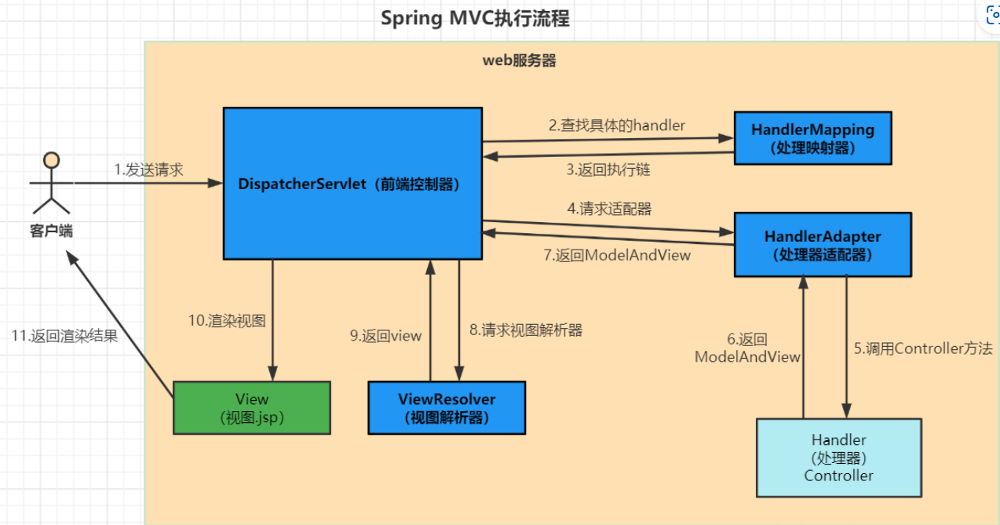
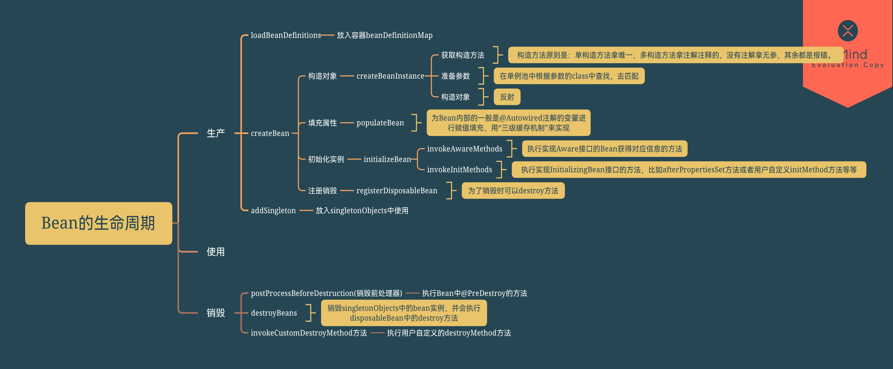

### 请介绍下SpringMvc的流程

> 也是在字节面试时遇到的真题，md，真的恶心，正好忘了。。。没啥特别的，死记硬背。
>
> 
>
> **Spring MVC的完整执行流程如下：**
>
> 1. 客户端发送请求给DispatcherServlet前端控制器
> 2. DispatcherServlet根据请求调用HandlerMapping处理器映射器
> 3. HandlerMapping解析请求对应的Handler，返回一个执行链
> 4. DispatcherServlet将执行链返回的Handler信息发给HandlerAdapter处理器适配器
> 5. HandlerAdapter会调用对应的Handler处理器(即Controller)
> 6. Handler执行完成后，会返回一个ModelAndView对象给HandlerAdapter
> 7. HandlerAdapter将接收到的ModelAndView对象返回给DispatcherServlet
> 8. DispatcherServlet根据ModelAndView对象选择合适的ViewResolver视图解析器
> 9. ViewResolver根据逻辑View返回实际的view给DispatcherServlet
> 10. DispatcherServlet对View进行渲染
> 11. 将视图渲染结果返回给浏览器（客户端）

### 请介绍下Spring中bean的生命周期

> 
>
> 看了很久，鉴定为寄，面试官问你就是纯粹恶心你。但是你只管大声答
>
> Bean生命周期主要分为创建、属性注入、初始化、使用、销毁这几个步骤
>
> 1. 首先解析xml配置或注解配置的类，得到BeanDefinition，通过BeanDefinition反射创建Bean对象
>
> 2. 对Bean进行属性填充(依赖注入)
>
> 3. 回调实现Aware接口方法，如BeanNameAware方法
>
> 4. 调用BeanPostProcessor的初始化前方法
>
> 5. 调用init初始化方法
>
> 6. 调用BeanPostProcessor的初始化后方法，进行aop
>
> 7. 将创建的Bean对象放入一个Map，业务中使用Bean对象。
>
> 8. Spring容器关闭时调用DisposableBean的destory方法。

### SpringBoot是如何实现自动装配的？

> 自动配置简单来说呢，就是将第三方的组件自动装载到IOC容器里面，不需要开发人员再去编写相关的配置，在SpringBoot应用里面呢只需要加上@SpringBootApplication注解就可以实现自动配置，SpringBootApplication它是一个复合注解，真正实现自动装配的注解是@EnableAutoConfiguration注解。自动装配的实现呢主要依靠三个核心的关键技术：
>
> 1）引入Starter，启动依赖组件的时候，这个组件里面必须包括@Configuration配置类，然后需要通过Bean注解去声明需要装配到IOC容器里面的Bean对象
>
> 2）这个配置类是放在第三方的jar包里面，然后通过Spring Boot中约定大于配置的理念，去把配置类的全路径放在META_INF/Spring.factories文件里面，SpringBoot就可以知道第三方jar包里面配置类的位置，它主要是依靠Spring里面的SpringFactorierLoader来完成的
>
> 3）SpringBoot拿到所有第三方jar包声明的配置类之后，再通过ImportSelector这样一个接口来实现对这些配置类的动态加载，从而去完成自动装配这样的一个动作。
>
> 总的来说，就是加载spring.factories中的autoConfiguration类，满足conditonal注解的条件时，就实例化该autoConfiguration中定义的bean。

### Spring如何解决循环依赖

> 1. 先创建 A 对象，并将创建出来的 A 对象放到 Spring 的三级缓存中；
> 2. 此时 A 对象的 b 属性为空，需要填充 b 属性，到缓存中查询 B 对象，没有查到，触发 B 对象的创建流程；
> 3. 创建 B 对象，并将创建出来的 B 对象放到 Spring 的三级缓存中；
> 4. B 对象的 a 属性为空，需要填充 a 属性，随后在缓存中找到 A 对象，完成填充注入；
> 5. 最后再对 A 对象的 b 属性进行填充，从缓存中顺利拿到 B 对象，完成属性注入，循环依赖到此解决。
> 6. 上边提到了三级缓存，那 Spring 的 一、二、三级缓存的作用是什么呢？
>
> singletonObjects：一级缓存，用于存放完整的 bean，从该缓存中取出的 bean 可以直接使用；
> earlySingletonObjects：二级缓存，存放提前暴露的 bean，bean 是不完整的，未完成属性注入和执行 init 方法，用于解决循环依赖；
> singletonFactories：三级缓存，对初始化后的 bean 完成 AOP 代理操作，bean 初始化完成之后才生成代理，而不是实例化之后就生成代理，保证了bean的生命周期。
