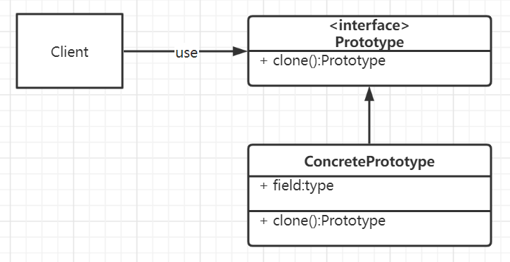

## 原型模式

### 定义

> 使用原型实例指定待创建对象的类型，并且通过复制这个原型来创建新的对象。

原型模式，实际上是从原型实例复制克隆出新实例，而绝不是从类去实例化，这个过程的区别一定要搞清楚！

### 解决场景

- 当一个对象的构建代价过高时。例如某个对象里面的数据需要访问数据库才能拿到，而我们却要多次构建这样的对象。
- 当构建的多个对象，均需要处于某种原始状态时，就可以先构建一个拥有此状态的原型对象，其他对象基于原型对象来修改。
- 在实际项目中，原型模式很少单独出现，一般是和工厂方法模式一起出现，通过 clone 的方法创建一个对象，然后由工厂方法提供给调用者。原型模式已经与 Java 融为浑然一体，大家可以随手拿来使用。

### UML图



### 实现

> 第一步 原型接口
>
> 原型接口必须有一个可以克隆自己的方法，反回类型为`Prototype`
>
> ```java
> public interface Prototype {
>     Prototype copy();
> }
> ```
>
> 第二步 原型类
>
> 这个类就是我们的原型类，准备被其他人克隆使用的，所以其实现`Prototype `接口，具备克隆的能力。根据业务需求，克隆可以是浅克隆，也可以是深克隆。
>
> 我们假设此类含有一个存放内容的`List`，这些数据都是从数据库读取的相对比较耗时。假设我们要生成多篇不同报表，内容基本不变（这是要点，只有你需要的对象是可以基于原型对象的才有意义），头部要不同。
>
> ① 对象创建原理 : 创建实例对象时使用原型模式 , 就是调用类的 clone 方法 , 直接克隆拷贝现有的实例对象 , 生成新的对象 ;
>
> ② 实现 Cloneable 接口 : 原型模式类需要实现 Cloneable 接口 , 如下面的 Student 类 ( class Student implements Cloneable ) 就实现了该接口 ;
>
> ③ 重写 clone() 方法 : 通常情况下直接调用父类的 clone 方法即可 , 这种方式是浅拷贝 ,
> 
>
> ```java
> public class Report implements Prototype {
>     private List<String> parts;
> 
>     public Report() {
>         this.parts = new ArrayList<>();
>     }
> 
>     public Report(List<String> parts) {
>         this.parts = parts;
>     }
>     //耗时的数据加载操作
>     public void loadData() {
>         pats.clear();
>         parts.add("你好啊");
>     }
> 
>     public List<String> getContents() {
>         return parts;
>     }
> 
>     @Override
>     public Prototype copy() {
>         List<String> cloneList = new ArrayList<>(parts);
>         return new Report(cloneList);
>     }
> }
> ```
>
> 第三步 客户端使用
>
> ```java
>     public void getReport(){
>         //创建原型
>         Report reportPrototype = new Report();
>         //耗费资源的操作
>         reportPrototype.loadData();
> 
>         //使用原型对象构建新的对象
>         Report reportWithTitle = (Report) reportPrototype.copy();
>         List<String> reportContent= reportWithTitle.getContents();
>         reportContent.add(0,"补充");
>         reportContent.add(1,"----------------------------------------------------------");
> 
>         for (String s : reportContent) {
>             System.out.println(s);
>         }
>     }
> }
> ```
>
> 输出
>
> ```java
> 补充
> ----------------------------------------------------------
> 你好啊
> ```
>
> 

### 优缺点

优点(提升性能)：

**① 性能高 :** 使用原型模式复用的方式创建实例对象 , 比使用构造函数重新创建对象性能要高 ; ( 针对类实例对象开销大的情况 )

**② 流程简单 :** 原型模式可以简化创建的过程 , 可以直接修改现有的对象实例的值 , 达到复用的目的 ; ( 针对构造函数繁琐的情况 )

缺点(复杂性提高):

**① 覆盖 clone 方法 ( 必须 )** : 必须重写对象的 clone 方法 , Java 中提供了 cloneable 标识该对象可以被拷贝 , 但是必须覆盖 Object 的 clone 方法才能被拷贝 ;

**② 深拷贝 与 浅拷贝 风险** : 克隆对象时进行的一些修改 , 容易出错 ; 需要灵活运用深拷贝与浅拷贝操作 ;


### 问题发现

2022-11-11

原型模式比new一个对象有什么优点

> 原型模式本质就是实现一个类似于Cloneable接口的功能，实现clone的方法。
>
> clone()不会调用构造方法；new会调用构造方法。
>
> 但是clone不一定在所有情况下都比new方法速度快。
>
> **jvm的开发者对于利用new操作生成对象进行了优化。**在一些轻量级对象的创立，推荐使用new方法，其他对象用clone方法。

原型模式的浅克隆和深克隆

> 1）使用clone()类必须实现java.lang.Cloneable接口并重写Object类的clone()方法，如果没有实现Cloneable()接口将会抛出CloneNotSupportedException异常。
>
> 2）默认的Object.clone()方法是浅拷贝，创建好对象的副本然后通过“赋值”拷贝内容，如果类包含引用类型成员变量，那么原始对象和克隆对象的引用类型成员变量将指向相同的引用内容。


参考文章:

[秒懂设计模式之原型模式（Prototype Pattern） - ShuSheng007](https://shusheng007.top/2021/09/08/017/)

[(51条消息) 【设计模式】原型模式 ( 概念简介 | 使用场景 | 优缺点 | 基本用法 )_韩曙亮的博客-CSDN博客_原型模式优缺点](https://blog.csdn.net/shulianghan/article/details/105239541)

