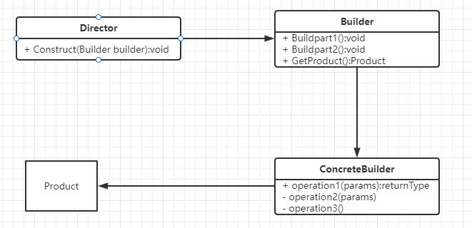

## 建造者模式

### 定义

> The intent of the Builder design pattern is to separate the construction of a complex object from its representation. By doing so the same construction process can create different representations.
> 将一个复杂对象的构建与其表示分离，使得同样的构建过程可以创建不同的表示
>
> 直接上英文原版定义,我估计很多人看不懂，其实就是**使用多个简单的对象一步一步构建成一个复杂的对象**

### 解决场景

这个非常重要，我相信大家学知识，并不是为了浮于表面，就是为了懂而懂，至少也要拿出来用，给别人讲讲也好。理解使用场景在很多情况下是大于你会不会使用这个设计模式。因为你知道什么问题使用建造者模式，即使不会写它，也可以通过查阅资料来实现。

话不多说，我们来看一个例子

假设有个猫这个类，当然不是正常的猫

```java
public class cat{
    private int age;//年龄
    private String name;//名字
    private String sex;//性别(可选)
    private String des;//描述(可选)
    private String cloth;//衣服(可选)
    private String mouse;//嘴巴(可选)
    private String tail;//尾巴(可选)
}
```

我们如何来构造这个猫呢

一般来说，我们有三种方式，**重载构造函数**，**javabean模式**，**builder模式**

一般人很快发现，构造函数，不能这样写，卧槽，居然这个猫的构造函数要写32个

笔者也是立马转成了javabean模式

什么是javabean模式呢

> 其实很简单，就是我们要求类中每个私有变量提供对应的get和set方法

但是，可能有人会问，哎呀，哎呀，javabean模式已经达到了我们想要的目的，我觉得挺简单的啦，为什么还有builder模式呢？

这种方法有个劣势就是构造的过程被分到几个调用中，在构造中可能处于不一致状态，无法保证一致性。***举个例子来说，线程A创建Person实例并只给name用set赋值，线程B创建Person实例只给age用set赋值，这样两个线程创建出来的两个实例我们就无法用构造方法上的参数来判断属性状态是否相同***

因为在实际开发中，我并没有遇到相应的问题，反而也觉得写一长串的set函数给对象赋值很冗余。

冗余、不一致，不安全。如何解决呢？builder说，“没事，我会出手”

### 实现

1. 在Computer 中创建一个静态内部类 Builder，然后将Computer 中的参数都复制到Builder类中。
2. 在Computer中创建一个private的构造函数，参数为Builder类型
3. 在Builder中创建一个`public`的构造函数，参数为Computer中必填的那些参数，cpu 和ram。
4. 在Builder中创建设置函数，对Computer中那些可选参数进行赋值，返回值为Builder类型的实例
5. 在Builder中创建一个`build()`方法，在其中构建Computer的实例并返回

```java
public class Cat{
    private int age;//年龄
    private String name;//名字
    private String sex;//性别(可选)
    private String des;//描述(可选)
    private String cloth;//衣服(可选)
    private String mouse;//嘴巴(可选)
    private String tail;//尾巴(可选)
    public Cat(Builder builder){
        this.age=builder.age;
        this.name=builder.name;
        this.sex=builder.sex;
        this.des=builder.des;
        this.cloth=builder.cloth;
        this.mouse=builder.mouse;
        this.tail=builder.tail;
    }
    public static class Builder{
        private int age;//年龄
        private String name;//名字
        private String sex;//性别(可选)
        private String des;//描述(可选)
        private String cloth;//衣服(可选)
        private String mouse;//嘴巴(可选)
        private String tail;//尾巴(可选)

        public Builder(int age, String name){
            this.age = age;
            this.name = name;
        }
        public Builder setSex(String sex){
            this.sex = sex;
            return this;
        }
        public Builder setDes(String des){
            this.des = des;
            return this;
        }
        public Builder setCloth(String cloth){
            this.cloth = cloth;
            return this;
        }
        public Builder setMouse(String mouse){
            this.mouse = mouse;
            return this;
        }
        public Builder setTail(String tail){
            this.tail = tail;
            return this;
        }
    }
}

//调用
Cat cat = new Cat(new Cat.Builder(1, "小明")
                         .setSex("男")
                         .setCloth("没衣服")
                         .setMouse("嘴巴")
                         .setTail("没尾巴"));

```

怎么样，是不是链式编程？这样显得代码简洁，又显得你技术力强悍。

但是上文是Builder在Java中一种简化的使用方式，经典的Builder 模式与其有一定的不同。

### 传统builder模式



如上图所示，builder模式有4个角色。

- Product: 最终要生成的对象，例如 Computer实例。
- Builder： 构建者的抽象基类（有时会使用接口代替）。其定义了构建Product的抽象步骤，其实体类需要实现这些步骤。其会包含一个用来返回最终产品的方法`Product getProduct()`。
- ConcreteBuilder: Builder的实现类。
- Director: 决定如何构建最终产品的算法. 其会包含一个负责组装的方法`void Construct(Builder builder)`， 在这个方法中通过调用builder的方法，就可以设置builder，等设置完成后，就可以通过builder的 `getProduct()` 方法获得最终的产品。

#### 方式

第一步：我们的目标Computer类：

```java
public class Computer {
    private String cpu;//必须

    private String keyboard;//可选

    public void setCpu(String cpu) {
        this.cpu = cpu;
    }

    public void setKeyboard(String keyboard) {
        this.keyboard = keyboard;
    }

    public Computer(String cpu, String keyboard) {
        this.cpu = cpu;
        this.keyboard = keyboard;
    }

    @Override
    public String toString() {
        return "Computer{" +
                "cpu='" + cpu + '\'' +
                ", keyboard='" + keyboard + '\'' +
                '}';
    }
}
```

第二步：抽象构建者类

```java
public abstract class ComputerBuilder {
    public abstract void setKeyboard();
    public abstract Computer getComputer();
}
```

第三步：实体构建者类，我们可以根据要构建的产品种类产生多了实体构建者类，这里我们需要构建两种品牌的电脑，苹果电脑和联想电脑，所以我们生成了两个实体构建者类。

```java
public class MacComputerBuilder extends ComputerBuilder {
    private Computer computer;
    public MacComputerBuilder(String cpu) {
        computer = new Computer(cpu);
    }
    @Override
    public void setKeyboard() {
        computer.setKeyboard("苹果键盘");
    }
    @Override
    public Computer getComputer() {
        return computer;
    }
}

public class LenovoComputerBuilder extends ComputerBuilder {
    private Computer computer;
    public LenovoComputerBuilder(String cpu) {
        computer=new Computer(cpu);
    }
    @Override
    public void setKeyboard() {
        computer.setKeyboard("联想键盘");
    }
    @Override
    public Computer getComputer() {
        return computer;
    }
}
```

第四步：指导者类（Director）

```java
public class ComputerDirector {
    public void makeComputer(ComputerBuilder builder){
        builder.setKeyboard();
    }
}
```

使用

```java
public class Main {
    public static void main(String[] args) throws Throwable {
        ComputerDirector computerDirector = new ComputerDirector();
        ComputerBuilder builder=new MacComputerBuilder("I5处理器");
        computerDirector.makeComputer(builder);
        System.out.println(builder.getComputer());
    }
}
输出:Computer{cpu='I5处理器', keyboard='苹果键盘'}
```

为了简单呈现，这里就设置了一个可选的参数-keyboard。

总流程:director(工头),builder(说明书),ConcreteBuilder(工人),computer(产品)

首先工头先上班（领导表率）,工人得到通知(工人知道要做什么),工头指挥工人做事，最终得到产品。

**建造者模式关注**该复杂对象是如何一步一步创建而成的，对于客户端而言，无需知道复杂对象的内部组成部分与装配方式，只需要知道建造者的类型即可。然后如果要造其他的产品，我们只需要再添加一个实体构建者类即可。是不是扩展很简单，但是修改很难。这就是开闭原则的体现。

是不是发现，其实之前介绍的builder变种模式，只不过，将director这个角色省略，然后构建相关的东西交给了client，其次将builder写到了要构建的产品类里面，最后采用了链式调用。

可能还有人不懂，说白了，其实变种就是将每个变量都看成一个可选变量，这样每个变量是不是都需要一个建造者？然后根据类型去赋予对应的值，所以本质上少了指挥那一层（主要对用户抽象）和抽象建造那一层（主要对功能抽象）

```java
//所以传统builder模式替换成变种builder模式就是这样
public class Computer {
    private String cpu;//必须
    private String keyboard;//可选
    public Computer(Builder builder){
        this.cpu=builder.cpu;
        this.keyboard=builder.keyboard;
    }
    @Override
    public String toString() {
        return "Computer{" +
                "cpu='" + cpu + '\'' +
                ", keyboard='" + keyboard + '\'' +
                '}';
    }
    public static class Builder{
        private String cpu;//必须
        private String keyboard;//可选
        public Builder(String cpu){
            this.cpu = cpu;
        }
        public Builder setKeyboard(String keyboard){
            this.keyboard = keyboard;
            return this;
        }
    }
}

public class Main {
    public static void main(String[] args) throws Throwable {
        Computer computer = new Computer(new Computer.Builder("I5处理器").setKeyboard("苹果键盘"));
        System.out.println(computer);
    }
}
输出:Computer{cpu='I5处理器', keyboard='苹果键盘'}
```

### 缺点

当然缺点也是很明显，**比较冗长**。。。。。

当然，Lombok说,"没关系，我会出手"!


### 问题发现

2022-11-10日

为什么java的set方法不返回this，这样就不要builder呀?

> 对于这个问题，我查阅了很多资料，最后得出结论，**返回什么都随便，按你自己的想法来**
>
> **更加推荐使用设计模式中的 Builder 模式 + field / withField 方法，在这些方法里返回 Builder this。**
>
> 在javabean规范中，set返回void，get返回变量值
>
> 注意：set不返回void可能导致一些框架无法读取相应的方法