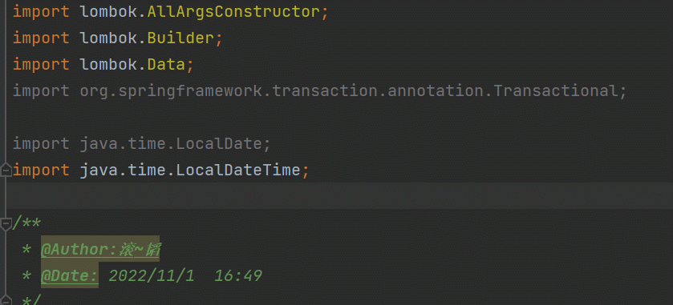
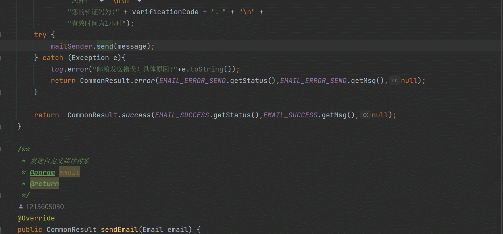
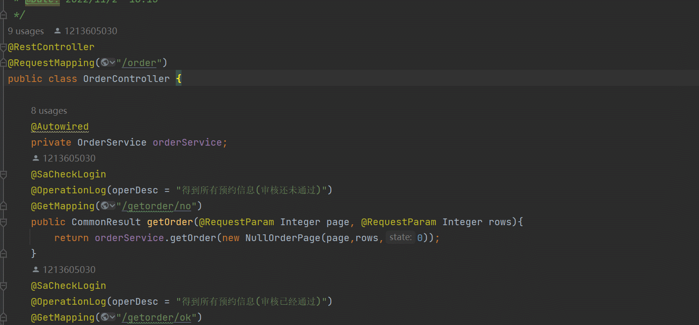
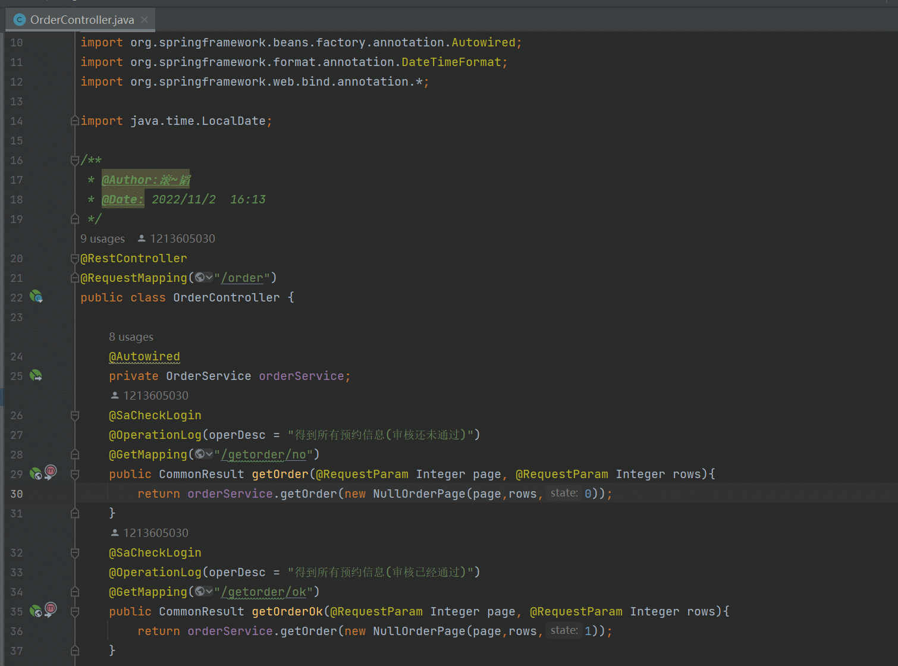

## idea快捷键分享

在日常开发中，idea是java开发者主要的开发工具，所以掌握快捷键是有效提升我们开发速度的方式

下面是一些基本的按键

| Ctrl + F        | 在当前文件进行文本查找 `（必备）`         |
| --------------- | ----------------------------------------- |
| Ctrl + R        | 在当前文件进行文本替换 `（必备）`         |
| Ctrl + Z        | 撤销 `（必备）`                           |
| Ctrl + Y        | 删除光标所在行 或 删除选中的行 `（必备）` |
| Ctrl + H        | 显示当前类的层次结构                      |
| Ctrl + O        | 选择可重写的方法                          |
| Ctrl + I        | 选择可继承的方法                          |
| Ctrl + +        | 展开代码                                  |
| Ctrl + -        | 折叠代码                                  |
| Ctrl + 左方向键 | 光标跳转到当前单词 / 中文句的左侧开头位置 |
| Ctrl + 右方向键 | 光标跳转到当前单词 / 中文句的右侧开头位置 |
| Ctrl + [        | 移动光标到当前所在代码的花括号开始位置    |
| Ctrl + ]        | 移动光标到当前所在代码的花括号结束位置    |

### ctrl+shift+o 自动删除不用包

### ctrl+alt+t 自动包裹try-catch，do-while这些

### ctrl+alt+u 查看UML图

### shift+shift 搜索类文件

### ctrl加左键点击只会进入接口声明，ctrl+alt+左键点击会进入实现类

