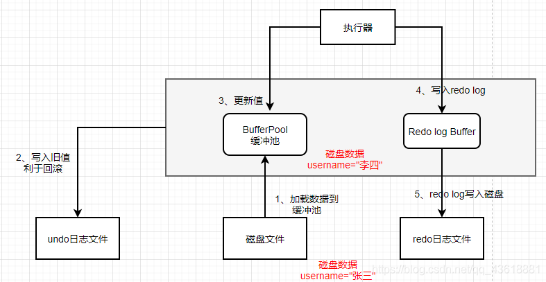

### Mysql执行简要流程

> 

### mysql连接器作用

> 管理连接和权限校验

### mysql语句执行流程

> ### SQL语句在Server层查询流程
>
> 那么究竟一条 sql 语句是如何执行的呢，下面我们分析一下一条查询语句的执行流程
>
> ```sql
> select user_id、username from t_user where username = "张三" and sex = 1
> ```
>
> 1、客户端发起查询请求，与连接器建立连接，连接器确定用户是否有查询权限，没有权限，直接返回错误信息，有执行下一步。
>
> 2、查询缓存(MySQL8.0 以前)，以这条SQL语句为key在内存缓冲池中是否有结果，有直接返回结果，无则执行下一步。
>
> 3、分析器进行词法分析，提取出操作为select, 表名为 t_user, 查询字段为user_id、username，查询条件为username=“张三” 和 sex=1 ,把提取的Token转换为抽象语法树.如下图
>
> 
>
> 接下来判断这个 sql 语句是否有语法错误，比如关键词是否正确等等，如果检查没问题就执行下一步。
>
> 4、优化器列出可能的执行方案
>
> ```sql
>  a. 先查询t_user表中username=“张三”的学生，然后判断是否性别为男。
>  b. 先找出学生中性别是男的学生，然后再查询username为“张三”的学生。
> ```
>
> 接下来计算两个查询计划的成本，若username字段为索引，usrname和sex为联合索引、或查询条件可能致使索引失效，查询字段为*，造成成全表扫描，都有可能影响执行方案的选择。
>
> 5、执行器进行权限校验，如果没有权限就会返回错误信息，如果有权限就执行器会调用数据库引擎接口，返回引擎的执行结果。
>
> 6、执行引擎根据执行计划查询数据，并把结果集返回客户端
>
> #### 总结流程
>
> 权限校验—>查询缓存—>分析器—>优化器—>权限校验—>执行器—>引擎


> ## SQL语句在Server层更新流程
>
> ```sql
> update t_user set username = "李四" where user_id = 1
> ```
>
> 1、InnoDB会先去BufferPool中去查找user_id=1的数据，没找到就会去磁盘中查找，如果查找到就会将这条记录加载到缓冲池BufferPool中，由于是更新操作，InnoDB会对这条记录加锁。
>
> 2、我们都知道SQL语句执行前默认是开启事务的，考虑到更新失败后的数据回滚，把更新前的数据写入undolog中
>
> 3、更新缓存池BufferPool的值为“李四”
>
> 
>
> 4、此时内存中的数据已经修改，但磁盘中的数据还未更新，为避免数据的丢失，需要把更新的值写入redo log Buffer中,
>
> 5、此时就可以准备事务的提交了，提交事务的同时会根据一定策略把redo log从buffer中刷入磁盘。此时若MySQL崩溃，重启可根据redo log日志把数据重新写入BufferPool中，避免了数据的丢失。此时redo log 处于 prepare 状态
>
> 可通过innodb_flush_log_at_trx_commit 参数来设置redo log刷盘策略。值为 0 表示不刷入磁盘； 值为 1 表示立即刷入磁盘 ；值为 2 表示先刷到 os cache
> 
>
> 6、到这里InnoDB层面的操作就差不多了，接下来执行器会生成更新操作的 binlog，并把binlog 日志写入磁盘
>
> 7、把本次更新的binlog文件名称和本次更新的binlog日志在文件里面的位置，都写入到redo日志文件中，同时在redo log日志中打上一个commit标记。此时redo log 处于 prepare 状态。至此，事务提交成功。
>
> 8、事务提交成功后，后台会另起io线程把脏数据刷入磁盘中。
> 
>
> #### 为什么写了redolog日志还要写binlog日志
>
> 性质不同，redolog是InnoDB独有的，文件大小有限，主要用于崩溃恢复，binlog是MySQL层面的日志，通过追加的方式记录，主要用于主从复制和数据恢复。
>
> #### 为什么要两阶段提交
>
> 我们看到redolog的提交分为两阶段，prepare和commit。为什么不先写undolog或者binlog呢。第5步和第6步都是事物开始的时候，一旦任意一步执行完毕因为系统宕机了。只写了两个中的任意一个。此时就会导致redo和binlog日志不一致的情况。并且即使执行了5，6步成功了，也不能保证redo和binlog日志是一样的。这就会导致了数据不一致的问题。而commit就是保证连个日志数据一致，事务才算提交成功。
>
> #### 总结流程
>
> BufferPool查找数据—>写入undo log—>修改内存数据—>写入redo log buffer—>提交事务时，把redo log刷盘—>binlog 刷盘—>redo log 完成commit标记—>内存中脏数据刷入磁盘