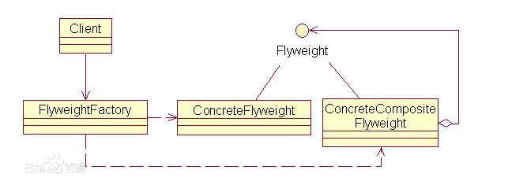

## 享元模式

### 定义

> 允许使用对象共享来有效地支持大量细粒度对象
>
> Flyweight Pattern

### UML图



(1) 抽象Flyweight：为具体享元角色规定了必须实现的方法，而外蕴状态就是以参数的形式通过此方法传入。在Java中可以由抽象类、接口来担当。

(2) 具体ConcreteFlyweight：实现抽象角色规定的方法。如果存在内蕴状态，就负责为内蕴状态提供存储空间。

(3) 享元FlyweightFactory：负责创建和管理享元角色。要想达到共享的目的，这个角色的实现是关键！

(4) 客户端Client：维护对所有享元对象的引用，而且还需要存储对应的外蕴状态。

有些会问到，为什么还有一个ConcreteCompositeFlyweight也实现了Flyweight。它的作用是当你不需要共享对象，又需要以统一接口处理这个对象，就可以使用这个对象。

共享对象的状态分为**内部状态**与**外部状态**，内部状态在各个对象间共享，而外部状态由客户端传入，这一点一定要牢记。

### 实例

第一步 定义一个共享对象的接口

```java
public interface Chess {
    //绘制棋子
    void draw(int x,int y);
}
```

第二步 实现需要共享的类

```java
//黑棋
public class BlackChess implements Chess {
    //内部状态，共享
    private final Color color = Color.BLACK;

    private final String sharp = "圆形";

    public Color getColor() {
        return color;
    }

    @Override
    public void draw(int x, int y) {
        System.out.println(String.format("%s%s棋子置于（%d，%d）处", sharp, color.getAlias(), x, y));
    }
}
//白棋
public class WhiteChess implements Chess {
    //内部状态，共享
    private final Color color = Color.WHITE;

    private final String sharp = "圆形";

    public Color getColor() {
        return color;
    }

    @Override
    public void draw(int x, int y) {
        System.out.println(String.format("%s%s棋子置于（%d，%d）处", sharp, color.getAlias(), x, y));
    }
}
```

第三步 共享对象工厂

```java
public class ChessFactory {
    private static final Map<Color, Chess> chessMap = new HashMap<>();

    public static Chess getChess(Color color) {
        Chess chess = chessMap.get(color);
        if (chess == null) {
            chess = color == Color.WHITE ? new WhiteChess() : new BlackChess();
            chessMap.put(color, chess);
        }
        return chess;
    }
}
```

第四步 客户端使用

```java
public class FlyweightClient {

    public void playChess() {
        //下黑子
        Chess backChess1 = ChessFactory.getChess(Color.BLACK);
        backChess1.draw(2, 5);

        //下白子
        Chess whiteChess = ChessFactory.getChess(Color.WHITE);
        whiteChess.draw(3, 5);

        //下黑子
        Chess backChess2 = ChessFactory.getChess(Color.BLACK);
        backChess2.draw(2, 6);

        System.out.println(String.format("backChess1:%d | backChess2:%d | whiteChess:%d",
                backChess1.hashCode(), backChess2.hashCode(), whiteChess.hashCode()));
    }
}
```

我们可以发现backChess1和backChess2是两个相同的对象，然后整个代码中也就只有两个对象，一个白子，一个黑子。

### 优缺点

优点:

- 极大减少内存中相似或相同对象数量，节约系统资源，提供系统性能

缺点:

- 为了使对象可以共享，需要将享元对象的部分状态外部化，分离内部状态和外部状态，使程序逻辑复杂


### 问题

2022-11-14 

享元模式和单例模式有什么区别吗

> 单例模式是类级别的，一个类只能有一个对象实例
>
> 享元模式是对象级别的，可以有多个对象实例，多个变量引用同一个对象实例
>
> 享元模式主要是为了节约内存空间，提高系统性能，而单例模式主要为了可以共享数据


参考:

[秒懂设计模式之享元模式（Flyweight Pattern） - ShuSheng007](https://shusheng007.top/2021/09/08/022/)
