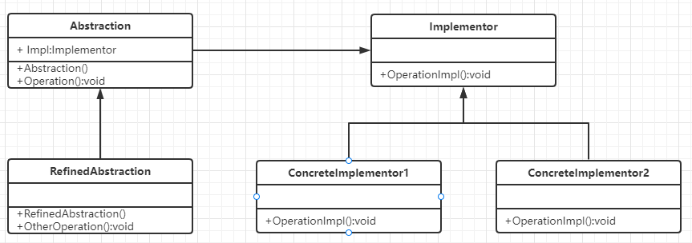

## 桥接模式

### 定义

> 桥接模式是将抽象部分与它的实现部分分离，使它们都可以独立地变化。它是一种对象结构型模式，又称为柄体(Handle and Body)模式或接口(Interfce)模式。

### 使用场景

> 桥接模式，主要是将两个独立的结构联系起来

### 实例

比如你设置了一个咖啡类，然后他有两个属性，一个糖度，一个容量

比如小中大三个容量、半糖、全糖、无糖三个选项

那么如果你要分各种情况，那么以上就是九种情况，还没有包含有没有放奶的情况

接下来看一个错误案例

 点咖啡接口

```java
public interface ICoffee {
    void orderCoffee(int count);
}
```

原味咖啡类

```java
public class CoffeeOriginal implements ICoffee {
    @Override
    public void orderCoffee(int count) {
        System.out.println(String.format("原味咖啡%d杯",count));
    }
}
```

加糖咖啡类

```java
public class CoffeeWithSugar implements ICoffee {
    @Override
    public void orderCoffee(int count) {
        System.out.println(String.format("加糖咖啡%d杯",count));
    }
}
```

。。。然后你会发现，卧槽，要定义九个实现类?

所以这里要用到桥接模式

有多种维度的变化，容量和味道和有没有放奶等等，如果使用继承，那么变化类将急剧增加。



桥梁模式所涉及的角色有：

- **抽象化(Abstraction)角色**：抽象化给出的定义，并保存一个对实现化对象的引用。
- **修正抽象化(RefinedAbstraction)角色**：扩展抽象化角色，改变和修正父类对抽象化的定义。
- **实现化(Implementor)角色**：这个角色给出实现化角色的接口，但不给出具体的实现。必须指出的是，这个接口不一定和抽象化角色的接口定义相同，实际上，这两个接口可以非常不一样。实现化角色应当只给出底层操作，而抽象化角色应当只给出基于底层操作的更高一层的操作。
- **具体实现化(ConcreteImplementor)角色**：这个角色给出实现化角色接口的具体实现。

可以将咖啡的容量作为**抽象化Abstraction**，而咖啡口味为**实现化Implementor**

第一步：创建实现化部分的接口定义（咖啡口味的维度）

```java
public interface ICoffeeAdditives {
    void addSomething();
}
```

第二步：创建抽象化部分的接口定义（咖啡容量的维度）

```java
//抽象化Abstraction
public abstract class Coffee {
    protected ICoffeeAdditives additives;
    public Coffee(ICoffeeAdditives additives){
        this.additives=additives;
    }
    public abstract void orderCoffee(int count);
}
```

我们可以看到，`Coffee`持有了`ICoffeeAdditives` 引用，`ICoffeeAdditives` 的实例是通过构造函数注入的，这个过程就是我们所说的**桥接**过程。我们通过这个引用就可以调用`ICoffeeAdditives`的方法，进而将`Coffee`的行为与`ICoffeeAdditives`的行为通过`orderCoffee()`方法而组合起来。

下面是一个对抽象化修正的一个类,在里面增加了一个用于品控的方法

```java
//抽象化的修正类
public abstract class RefinedCoffee extends Coffee {
    public RefinedCoffee(ICoffeeAdditives additives) {
        super(additives);
    }
    public void checkQuality(){
        Random ran=new Random();
        System.out.println(String.format("%s 添加%s",additives.getClass().getSimpleName(),ran.nextBoolean()?"太多":"正常"));
    }
}
```

第三步：实现实现化部分（咖啡口味维度）的接口`ICoffeeAdditives`

```java
//加奶
public class Milk implements ICoffeeAdditives {
    @Override
    public void addSomething() {
        System.out.println("加奶");
    }
}
//加糖
public class Sugar implements ICoffeeAdditives {
    @Override
    public void addSomething() {
        System.out.println("加糖");
    }
}
```

第四步：实现抽象化部分（咖啡的容量维度）的接口`Coffee`

```java
//大杯
public class LargeCoffee extends RefinedCoffee {
    public LargeCoffee(ICoffeeAdditives additives) {
        super(additives);
    }

    @Override
    public void orderCoffee(int count) {
        additives.addSomething();
        System.out.println(String.format("大杯咖啡%d杯",count));
    }
}
//小杯
public class SmallCoffee extends RefinedCoffee {
    public LargeCoffee(ICoffeeAdditives additives) {
        super(additives);
    }

    @Override
    public void orderCoffee(int count) {
        additives.addSomething();
        System.out.println(String.format("小杯咖啡%d杯",count));
    }
}
//中杯
...
```

第四步：客户端调用

```java
    public static void main(String[] args) {
        //点两杯加奶的大杯咖啡
        RefinedCoffee largeWithMilk=new LargeCoffee(new Milk());
        largeWithMilk.orderCoffee(2);
        largeWithMilk.checkQuality();
    }
//加奶
//大杯咖啡2杯
//Milk 添加太多
```

所以可见，桥接模式是将组合之间的乘法关系替换成了加法关系

本来3x3的类扩展变成了3+3，少了很多,很方便

### 优缺点

优点：

- 分离抽象接口及其实现部分。桥接模式使用“对象间的关联关系”解耦了抽象和实现之间固有的绑定关系，使得抽象和实现可以沿着各自的维度来变化。所谓抽象和实现沿着各自维度的变化，也就是说抽象和实现不再在同一个继承层次结构中，而是“子类化”它们，使它们各自都具有自己的子类，以便任何组合子类，从而获得多维度组合对象。
- 在很多情况下，桥接模式可以取代多层继承方案，多层继承方案违背了“单一职责原则”，复用性较差，且类的个数非常多，桥接模式是比多层继承方案更好的解决方法，它极大减少了子类的个数。
- 桥接模式提高了系统的可扩展性，在两个变化维度中任意扩展一个维度，都不需要修改原有系统，符合“开闭原则”。

缺点：

- 桥接模式的使用会增加系统的理解与设计难度，由于关联关系建立在抽象层，要求开发者一开始就针对抽象层进行设计与编程。
- 桥接模式要求正确识别出系统中两个独立变化的维度，因此其使用范围具有一定的局限性，如何正确识别两个独立维度也需要一定的经验积累。


三层维度也是同理，一层套一层

参考:

[(51条消息) 桥接模式的三维度实例_xiaozou_it的博客-CSDN博客](https://blog.csdn.net/xiaozou_it/article/details/80196202)