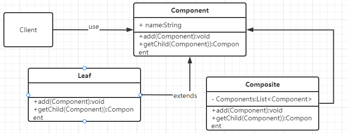

## 组合模式

### 定义

> 组合模式允许以相同的方式处理单个对象和对象的组合体

### 使用场景

- 当你的程序结构有类似树一样的层级关系时，例如文件系统，视图树，公司组织架构等等
- 当你要以统一的方式操作单个对象和由这些对象组成的组合对象的时候。
- 想让用户忽略组合对象和单个对象的不同，用户将统一的使用组合结构中的所有对象。



从上图可见组合模式共有3组成部分

- Component

抽象类，定义统一的处理操作。

- Leaf

叶子节点，即单个对象

- Composite

组合对象，里面持有一个`List<Component>`。

### 实例

第一 设计一个个体与组合通用的接口

```java
public abstract class OrganizationComponent {
    private String name;

    public OrganizationComponent(String name) {
        this.name = name;
    }

    public String getName() {
        return name;
    }

    public abstract void add(OrganizationComponent organization);

    public abstract OrganizationComponent getChild(String orgName);

    public abstract int getStaffCount();

    @Override
    public String toString() {
        return name;
    }
}
```

第二 组合类

```java
public class OrganizationComposite extends OrganizationComponent {
    //很关键，这体现了组合的思想,本质上其实就是加了一个list 
    private List<OrganizationComponent> organizations = new ArrayList<>();
    public OrganizationComposite(String name) {
        super(name);
    }

    @Override
    public void add(OrganizationComponent organization) {
        organizations.add(organization);
    }

    @Override
    public OrganizationComponent getChild(String orgName) {
        for (OrganizationComponent org : organizations) {
            OrganizationComponent targetOrg = org.getChild(orgName);
            if (targetOrg != null) {
                return targetOrg;
            }
        }
        return null;
    }

    @Override
    public int getStaffCount() {
        int count = 0;
        for (OrganizationComponent organization : organizations) {
            count += organization.getStaffCount();
        }
        return count;
    }
}   
```

第三 叶子节点

叶子节点就是单个对象了，我们要使用合适的方式处理那些叶子节点不支持的对外接口方法。因为用户使的时候只会看到对外暴露的统一接口，他不知道此对象是叶子节点还是组合对象。

```java
public class ItDepartment extends OrganizationComponent {

    public ItDepartment(String name) {
        super(name);
    }

    @Override
    public int getStaffCount() {
        return 20;
    }

    @Override
    public void add(OrganizationComponent organization) {
        throw new UnsupportedOperationException(this.getName()+"已经是最基本部门，无法增加下属部门");
    }

    @Override
    public OrganizationComponent getChild(String orgName) {
        if(getName().equals(orgName)){
            return this;
        }
        return null;
    }
}
```

 第四 客户端

首先构建一个组合对象。模拟构建一家公司，公司下设行政部门和IT部门，还有一个天津分公司，而天津分公司又下设一个行政部门和IT部门。

然后我确定查询这个公司任何部门的员工人数。我们可以看到在查询过程中，我们没有判断当前对象到底是什么部门对象，都是以统一的接口在操作。

```java
public class CompositeClient {

    private OrganizationComponent constructOrganization() {
        //构建总部
        OrganizationComposite head = new OrganizationComposite("总公司");
        AdminDepartment headAdmin = new AdminDepartment("总公司行政部");
        ItDepartment headIt = new ItDepartment("总公司It部");
        head.add(headAdmin);
        head.add(headIt);

        //构建分公司
        OrganizationComposite branch1 = new OrganizationComposite("天津分公司");
        AdminDepartment branch1Admin = new AdminDepartment("天津分公司行政部");
        ItDepartment branch1It = new ItDepartment("天津分公司It部");
        branch1.add(branch1Admin);
        branch1.add(branch1It);

        //将分公司加入到head中
        head.add(branch1);

        return head;
    }

    public void listOrgInfo() {
        OrganizationComponent org = constructOrganization();
        System.out.println(String.format("%s共有%d名员工",
                org.getName(), org.getStaffCount()));

        OrganizationComponent subOrg = org.getChild("天津分公司行政部");
        System.out.println(String.format("%s共有%d名员工",
                subOrg.getName(), subOrg.getStaffCount()));
    }
}

```

### 优缺点

优点

- 可以递归组合成任意复杂的对象
- 可随意增加新类型的`Composite`与`Leaf`的类
- 简化了客户端代码，因为不论对象多么复杂客户端都是以同一套接口操作

缺点

- 如果需要确定某个组件是特殊组织，然后针对它做特殊的操作，就需要在运行时判断。

- 在使用组合模式时，其叶子和树枝的声明都是实现类，而不是接口，违反了依赖倒置原则。

  

