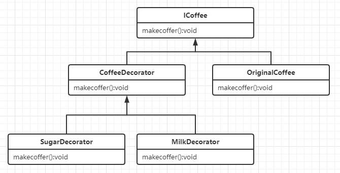

### 装饰器模式

### 定义

> 装饰模式是在不必改变原类和使用继承的情况下，动态地扩展一个对象的功能。它是通过创建一个包装对象，也就是装饰来包裹真实的对象

### 使用场景

- 需要在运行时动态的给一个对象增加额外的职责时候
- 需要给一个现有的类增加职责，但是又不想通过继承的方式来实现的时候（应该优先使用组合而非继承），或者通过继承的方式不现实的时候（可能由于排列组合产生类爆炸的问题）。

### 实例

比如桥接模式的咖啡问题

现在增加一个新的需求，比如我要求在制作咖啡中，动态的改变过程，比如要求先加奶再加糖



第一步：先声明一个原始对象的接口

```java
public interface ICoffee {
    void makeCoffee();
}
```

第二步：构建我们的原始对象，此处为原味咖啡对象，它实现了`ICoffee`接口。

```java
public class OriginalCoffee implements ICoffee {
    @Override
    public void makeCoffee() {
        System.out.print("原味咖啡 ");
    }
}
```

第三步：构建装饰者抽象基类，它要实现与原始对象相同的接口`ICoffee`，其内部持有一个`ICoffee`类型的引用，用来接收被装饰的对象

```java
public abstract class CoffeeDecorator implements ICoffee {
    private  ICoffee coffee;
    public CoffeeDecorator(ICoffee coffee){
        this.coffee=coffee;
    }

    @Override
    public void makeCoffee() {
        coffee.makeCoffee();
    }
}
```

第四步：构建各种装饰者类，他们都继承至装饰者基类 `CoffeeDecorator`。此处生成了两个，一个是加奶的装饰者,另一个是加糖的装饰者。

```java
public class MilkDecorator extends CoffeeDecorator {
    public MilkDecorator(ICoffee coffee) {
        super(coffee);
    }
    @Override
    public void makeCoffee() {
        super.makeCoffee();
        addMilk();
    }
    private void addMilk(){
           System.out.print("加奶 ");
    }    
}
public class SugarDecorator extends CoffeeDecorator {
    public SugarDecorator(ICoffee coffee) {
        super(coffee);
    }
    @Override
    public void makeCoffee() {
        super.makeCoffee();
        addSugar();
    }
    private void addSugar(){
           System.out.print("加糖");
    } 
}
```

第五步：客户端使用

```java
    public static void main(String[] args) {
        //原味咖啡
        ICoffee coffee=new OriginalCoffee();
        coffee.makeCoffee();
        System.out.println("");

        //加奶的咖啡
        coffee=new MilkDecorator(coffee);
        coffee.makeCoffee();
        System.out.println("");

        //先加奶后加糖的咖啡
        coffee=new SugarDecorator(coffee);
        coffee.makeCoffee();
    }
```

输出：

```
原味咖啡 
原味咖啡 加奶 
原味咖啡 加奶 加糖 
```


### 优缺点

优点:

- 可以提供比继承更加灵活的方式去扩展对象的功能，通过排列组合，可以对某个类的一些对象做动态的功能扩展，而不需要装饰的对象却可以保持原样。

缺点:

- 类的个数会增加，会产生很多装饰者类，相应的就增加了复杂度。