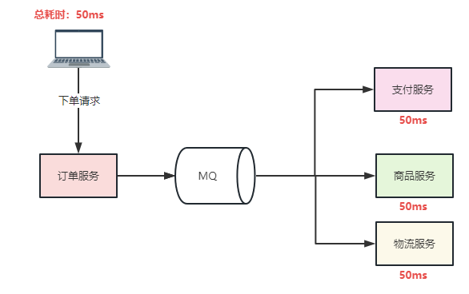

4399一面面经      8.25  15min

1. map和hashmap的区别和使用场景？

   > 真要说区别的话，map只是一个接口，hashmap实现了map。
   >
   > 使用场景的话，我用的比较多的是用ThreadLocalMap，跟hashmap差不多的数据结构，为了当缓存使用。

2. HTTP1.1和2.0的区别？

   > **多路复用（Multiplexing）**：HTTP/2.0 在同一连接上可以同时传输多个请求和响应（可以看作是 HTTP/1.1 中长链接的升级版本），互不干扰。HTTP/1.1 则使用串行方式，每个请求和响应都需要独立的连接，而浏览器为了控制资源会有 6-8 个 TCP 连接都限制。这使得 HTTP/2.0 在处理多个请求时更加高效，减少了网络延迟和提高了性能。
   >
   > **二进制帧（Binary Frames）**：HTTP/2.0 使用**二进制帧**进行数据传输，而 HTTP/1.1 则使用**文本格式**的报文。二进制帧更加紧凑和高效，减少了传输的数据量和带宽消耗。
   >
   > **头部压缩（Header Compression）**：HTTP/1.1 支持`Body`压缩，`Header`不支持压缩。HTTP/2.0 支持对`Header`压缩，使用了专门为`Header`压缩而设计的 HPACK 算法，减少了网络开销。
   >
   > **服务器推送（Server Push）**：HTTP/2.0 支持服务器推送，可以在客户端请求一个资源时，将其他相关资源一并推送给客户端，从而减少了客户端的请求次数和延迟。而 HTTP/1.1 需要客户端自己发送请求来获取相关资源。

3. 项目的难点和创新点？

   > 因为是一开始做订单类的项目，我也把它当作一个学习项目，所以微服务的搭建还是比较繁琐的。
   >
   > 因为相比Springboot单点项目，我那个微服务项目本质上其实就多了Nacos注册中心和一个网关和一个Feign远程调用。所以我这个项目如果论开发难点，不多。主要做了几个点，比如Redis数据预热，提前将mysql库存读到Redis，之后由Redis来管理库存操作先，Mysql之后同步。用MQ进行削峰，加快响应速度。还是比较常规吧。
   >
   > 

4. 计算机网络中的四元组是什么？如果是五元组呢？

   > 四元组：源IP地址（[sip](https://so.csdn.net/so/search?q=sip&spm=1001.2101.3001.7020)）、目的IP地址(dip)、源端口(sport)、目的端口(dport)
   >
   > 五元组：源IP地址、目的IP地址、协议号(Protocol )、源端口、目的端口
   >
   > 七元组：源IP地址、目的IP地址、协议号、源端口、目的端口，服务类型以及接口索引

5. IPV4地址有几个字节，回环地址是什么（回答了127.0.0.1，继续追问还有呢？）

   > 4个字节(32位),127.0.0.0到127.255.255.255都是回环地址

6. IPV6地址有几个字节，回环地址是什么？（回环没答上来）

   > **16个字节**(128位), *0:0:0:0:0:0:0:1*

7. Linux的>是什么意思？

   > 　>会覆盖目标的原有内容，当文件存在时，会先删除原文件，再重新创建文件，然后把内容写入该文件，否则直接创建文件。
   >
   > 　>>会在目标原有内容后追加内容，当文件存在时直接在文件末尾进行内容追加，不会删除原文件，否则直接创建文件。

8. Linux移动文件和修改文件名的指令？

   > mv [源文件或目录] [目标目录]
   >
   > ```shell
   > mv file.txt /home/user/documents/
   > ```
   >
   > mv [原文件名] [新文件名]
   >
   > ```shell
   > mv file.txt newfile.txt
   > ```

9. SQL语句的选择关键字是什么？

   > select

10. 如果一个计算机有两个网卡，如何在软件层面实现ping的时候具体ping哪一张网卡？（问题都没怎么听懂，描述也不一定准确）

> 可以用ping -S去指定源地址

4399二面HR面面经   9.1   15min
都是一些很常规的HR面试问题，加班看待，学习方法，家庭情况之类，印象深刻一点的就几个

1. 加班看待

   > 我觉得互联网公司加班是正常现象吧，公司里平常的加班我还是能接受的，比如工作日加班，偶尔周末加班也能接受，如果每次周末都要加班的话，还是扛不住的。

2. 学习方法

   > 我一般先去找一些博客了解一些生态，然后去官网找找案例demo跑起来，如果有必要，也会去b站这些搜搜视频

3. 问了理想的薪酬，说了12k

4. 问了平时喜欢什么游戏

   > 主要喜欢fps游戏多一点吧，或者类银河恶魔城这种，我感觉很有操作感觉。

4399三面主管面经   9.4   15min
是一个年龄比较大的，感觉是主管，技术中夹带闲聊

1. 本科毕设是做什么的？

2. 毕设准备做什么方向？

3. 问了项目的创新点

4. 看过哪些源码？

   > influxdb-spring这个官方源码，因为想做类似于mybatis这样的封装，官方只有几个简单的配置，没有查询的模板。然后其余情况下，源码看的比较少，调试的时候会去看看。

5. 反问，面试流程还有几轮，他说是最后一轮了

