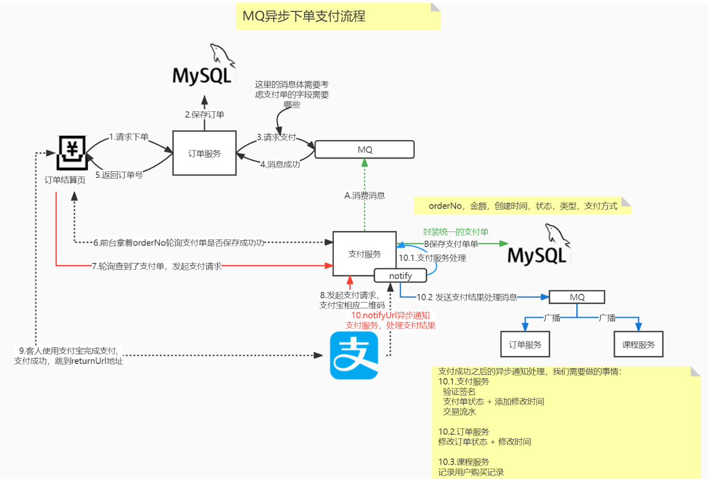

1.注册中心如何判断服务正不正常的

> 一般来说，注册中心检测服务正不正常，有两个方式：
>
> 客户端主动上报和服务端主动探测客户端。前者叫心跳检测（主流），后者叫主动探测
>
> 毕竟，服务的数量远大于注册中心的数量，所以主动探测压力比较大。
>
> Nacos本身提供了两种注册实例:
>
> - 临时实例，临时存在于注册中心，在服务下线或不可用时被注册中心剔除。临时实例会与注册中心保持心跳，注册中心在⼀段时间没收到来自客户端的心跳后就将实例设置为不健康，然后在⼀段时间后剔除
> - 永久实例在被删除之前会永久的存在于注册中心，且可能不知道注册中心存在，不会主动向注册中心上报心跳，这时就要注册中心主动探活
>
> ##### 心跳时好时坏怎么办？
>
> 可以使用**可用率**。可用率的计算方式是某一个时间窗口内接口调用成功次数的百分比（成功次数 / 总调用次数）。当可用率低于某个比例就认为这个节点有问题，把它挪到亚健康列表，这样既考虑了高低频的调用接口，也兼顾了接口响应时间不同的问题。

2.为何要用异步Service

> 比如说生成验证码和发送验证码的，如果等发送到验证码，再通知用户，那可能用户觉得验证码卡了。
>
> 或者购买商品，可以做到削峰的作用，防止大量请求占满数据库（万一突然很多人买），当然，用MQ更好

3.Oss是啥你了解吗，怎么用的，CDN呢，有什么不同

> Oss是对象存储服务，本质上其实就是一个文件服务器，然后图片上传。
>
> ### 为什么图片这些静态资源不直接存本地
>
> 1.服务器的内存是有限的
>
> 2.上传文件会占用服务器的带宽
>
> 对于上传文件至阿里云OSS，常见的实现方案有三种：
>
> 1. 前端将文件上传给后端，再由后端服务上传至阿里云的OSS；（占带宽）
> 2. 前端直接将文件上传至阿里云的OSS，再将阿里云返回的文件信息传给服务端；（不安全）
> 3. 前端请求服务端获取上传的过程中的鉴权信息，然后将文件上传至阿里云OSS，再将阿里云返回的文件信息保存到服务端。
>
> 一下是一个知乎很好的回答
>
> Q：前端上传完，后端怎么知道上没上传完？
>
> A：前端上传完主动通知后端，或者OSS也有回调功能，OSS去通知后端
>
> Q：别骗我，OSS上传是需要token和秘钥的，我直接放前端那岂不是白给啊？
>
> A：提供token和秘钥只是上传文件的其中一种方式而已，我们可以使用**“表单上传”**的方式，简单来说后端可以根据秘钥去生成一个sign字符串，sign字符串不会暴露密钥，就是前端发起POST请求给OSS，请求体里附带上sign（后端给你的）、key（要上传文件的位置）、file（你要上传的文件）这几样参数就完事了，没有秘钥泄露，大功告成。
>
> Q：这不就漏洞就来了，key（上传位置）是前端决定的，那我只需要从你后端拿到sign，然后我想上传到哪都是我自己说的算，想上传多大的文件也是我自己决定的，反正你后端验证不了，阁下该如何应对？
>
> A:sign里面包含了policy，也就上传时，要遵守policy里面的规范，比如说位置、最大最小、是否覆盖等等，不存在。
>
> Q：但是sign值不是一次性的啊，后端生成的sign在有效期内前端是可以一直使用的，我拿你的sign就非得做坏事，你该怎么办？
>
> A:policy某种程度上都考虑到了，比如说确定了上传位置，大小，防止重复上传，你拿着一直用也无济于事
>
> CDN内容分发网络，主要就是将资源缓存到离用户最近的节点，加快静态资源的访问。

4.说一下你的项目整个支付流程

> 1. 首先用户先去后端请求一个唯一token,并跳转到订单详情界面
>
> 2. 在订单详情页面设置了提醒一个最晚支付时间，15分钟内要下单，然后后端通过rocketMQTemplate.syncSend向mq发送一个延迟消息，15分钟之后检查订单是否为待支付，则修改订单服务和支付服务的订单状态为已取消。
>
> 3. 用户点击下单后，将携带token和商品信息以及价格数量等信息到后台，然后创建订单并保存到数据库，设置为待完成。只需要将订单信息交给MQ，然后给用户一个正在下单的信息。由支付服务这边去保存支付单。
>
> 4. 前端定时器轮询去数据库中查询支付服务的支付订单，查询到后后端将单号返回给前端。
>
> 5. 前端获取到后携带单号以及一些必要的属性向后端支付接口发起调用，支付服务去调用微信的支付接口，返回微信给的form表单给前端，剩下的交给微信去操作了。
>
> 6. 前端支付完成后通过回调地址跳转。
>
> 7. 微信之后根据一个notify_url进行通知，然后再去发送支付结果处理消息到MQ。并且通过push方式推到订单系统，然后将对应订单状态修改为完成。
>
>    
>
>    

5.cookie和session的区别。什么情况用cookie，什么情况下用session

> cookie是服务器发送到用户浏览器并保存本地的数据，它会在浏览器下次向同一服务器再发起请求时被携带并发送到服务器上。通常，它用于告知服务端两个请求是否来自同一浏览器，如保持用户的登录状态。可保持长时间
>
> Session 代表着服务器和客户端一次会话的过程。Session 对象存储特定用户会话所需的属性及配置信息。失效时期短。
>
> 数据不敏感，保持状态的信息可以用cooki，敏感信息和复杂状态可以用session
>
> 往往结合使用，可以使用Cookie存储一个Session ID，而将实际的用户状态信息存储在服务器端的Session中。这样做既可以利用Cookie的便捷性，又可以保证Session数据的安全性。

6.为什么用InfluxDB时序数据库，不用Mysql数据库来存储

> 因为硬件设施，每10秒上传上报一次自己的状态，假如有1000台设备，那么每天生产上百万条数据，普通的mysql数据库肯定是不行的。首先查询和插入很慢，并且要频繁分库分表，花钱花力。
>
> 作为时序数据库，influxdb支持数据压缩，支持类sql语句，支持多种聚合运算，可以有效的查看一段期间内数据的平均值。

7.代码题:组合数字

> ```java
> class Solution {
>     public List<List<Integer>> combinationSum(int[] candidates, int target) {
>         List<List<Integer>> ans = new ArrayList<List<Integer>>();
>         List<Integer> combine = new ArrayList<Integer>();
>         dfs(candidates, target, ans, combine, 0);
>         return ans;
>     }
> 
>     public void dfs(int[] candidates, int target, List<List<Integer>> ans, List<Integer> combine, int idx) {
>         if (idx == candidates.length) {
>             return;
>         }
>         if (target == 0) {
>             ans.add(new ArrayList<Integer>(combine));
>             return;
>         }
>         // 直接跳过
>         dfs(candidates, target, ans, combine, idx + 1);
>         // 选择当前数
>         if (target - candidates[idx] >= 0) {
>             combine.add(candidates[idx]);
>             dfs(candidates, target - candidates[idx], ans, combine, idx);
>             combine.remove(combine.size() - 1);
>         }
>     }
> }
> ```
>
> 