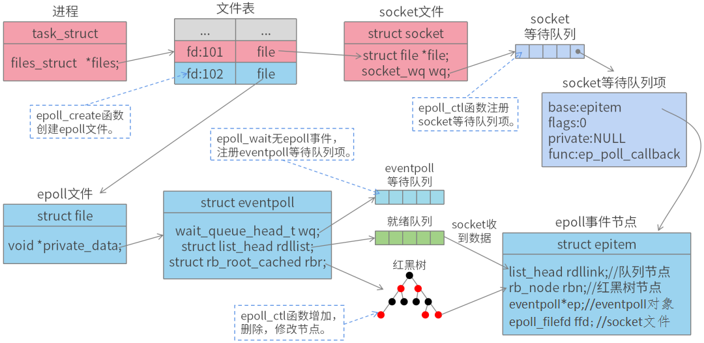

1. ### 怎么使用布隆过滤器解决缓存穿透问题

   > 缓存穿透就是指就查询一个根本不存在的数据，布隆过滤器可以很快的帮助我们判断数据在不在。

2. ### nio、bio和aio的区别

   > bio是同步阻塞IO
   >
   > nio是同步非阻塞IO，一个线程可以处理多个连接
   >
   > aio是异步非阻塞，AIO 引入异步通道的概念，采用了 Proactor 模式，简化了程序编写，有效的请求才启动线程，它的特点是先由操作系统完成后才通知服务端程序启动线程去处理，一般适用于连接数较多且连接时间较长的应用。

3. ### 解释一下epoll的执行流程、怎么用epoll实现多路复用、epoll怎么使用

   > 首先系统创建一个eventpoll对象，之后将需要监听的socket添加对应的eventpoll，这样内核就会将eventpoll添加到这三个socket的等待队列中，eventpoll收到数据后，中断程序让rdlist引用这些socket。
   >
   > 然后某进程A正在运行，运行到epoll_wait语句，内核就会将进程A放入eventpoll的等待队列，阻塞进程。
   >
   > 之后Socket接受到数据，中断程序修改rdlist，同时唤醒A进程。因为rdlist存在，进程A可以知道哪些socket发生变化。
   >
   > 

4. ### 为什么nio是同步和非阻塞

   > 首先一个IO操作(read/write系统调用)其实分成了两个步骤：1、发起IO请求；2、实际的IO读写(内核态与用户态的数据拷贝)
   >
   > 阻塞IO和非阻塞IO的区别在于第一步，发起IO请求的进程是否会被阻塞，如果阻塞直到IO操作完成才返回那么就是传统的阻塞IO，如果不阻塞，那么就是非阻塞IO。
   >
   > 同步IO和异步IO的区别就在于第二步，实际的IO读写(内核态与用户态的数据拷贝)是否需要进程参与，如果需要进程参与则是同步IO，如果不需要进程参与就是异步IO。
   >
   > 为什么是非阻塞，因为NIO Reactor的**线程不会阻塞**，一直在处理各种事件
   >
   > 为什么是同步，因为需要NIO的线程自己去将数据从内核态拷贝到用户态，也需要将数据从用户态拷贝到内核态。

5. ### 为什么同步详细说说

6. ### mysql索引为什么不用b-树

   > **1、B+树的层级更少。**
   >
   > 相较于B树B+每个非叶子节点存储的关键字数更多，树的层级更少所以查询数据更快；
   >
   > **2、B+树查询速度更稳定。**
   >
   > B+所有关键字数据地址都存在叶子节点上，所以每次查找的次数都相同所以查询速度要比B树更稳定;
   >
   > **3、B+树天然具备排序功能。**
   >
   > B+树所有的叶子节点数据构成了一个有序链表，在查询大小区间的数据时候更方便，数据紧密性很高，缓存的命中率也会比B树高。
   >
   > **4、B+树全节点遍历更快。**
   >
   > B+树遍历整棵树只需要遍历所有的叶子节点即可，而不需要像B树一样需要对每一层进行遍历，这有利于数据库做全表扫描。

7. ### redis是单线程，他是怎么实现设置key的过期的

   > 首先将key放到一个dictEntry过期列表中，存储了key的过期时间。（不存储value值）
   >
   > 然后Redis支持两种方式
   >
   > 一种是惰性删除，就是等要用的时候，去判断下key是否过期。还有一个是定时任务，通过一个事件通知，在主循环中调用时间函数，从一个库中随机抽取20个处理过期key，如果过期的key超过key总数10%，会继续扫描当前库。

8. ### 布隆过滤器是只有一个哈希函数还是多个哈希函数，哪个好，为什么

   > 多个，只有一个的话，发生哈希冲突的概率高，就丧失了快速判断的优势。但是也不能太多哈希函数，会增加计算时间和空间消耗

9. ### 令牌桶算法怎么实现限流的，说说底层原理，详细说说怎么具体实现一个令牌桶算法

   > - 定时定量向令牌桶投入令牌，令牌桶有容量限制，令牌桶容量满了则丢弃不再投入令牌。
   > - 在发送报文时，如果令牌桶的令牌数量小于要发送的网络数据大小，则等待令牌桶的数量足够再发送；如果令牌桶的令牌数量大于等于要发送的网络数据大小，则报文直接发送，并减少令牌桶中对应数量的令牌。

10. ### 为什么一定要定时任务来生成令牌，可不可以不用

    > 可以不用，可以等到下次请求时计算两者的时间差，然后补充令牌数,但是会出现线程安全问题。

11. ### 限流算法中的滑动窗口算法，介绍一下其实现原理过程

    > - 将时间划分为多个区间
    > - 在每个区间内每有一次请求就进计数器加1维持一个时间窗口，占据多个区间
    > - 每经过一个区间的时间，则抛弃最老的一个区间，并纳入最新的一个区间
    > - 若当前的窗口内区间的请求总数和超过了限制数量，**则本窗口内的请求都被丢弃**

12. ### 股票交易代码题

> ```java
> public class Solution {
>     public int maxProfit(int prices[]) {
>         int min = Integer.MAX_VALUE;
>         int maxProfit = 0;
>         for(int i : prices){
>             if(i<min){
>                 min = i;
>             }else{
>                 if(i-min>maxProfit){
>                     maxProfit = i-min;
>                 }
>             }
>         }
>         return maxProfit;
>     }
> ```
>
> 