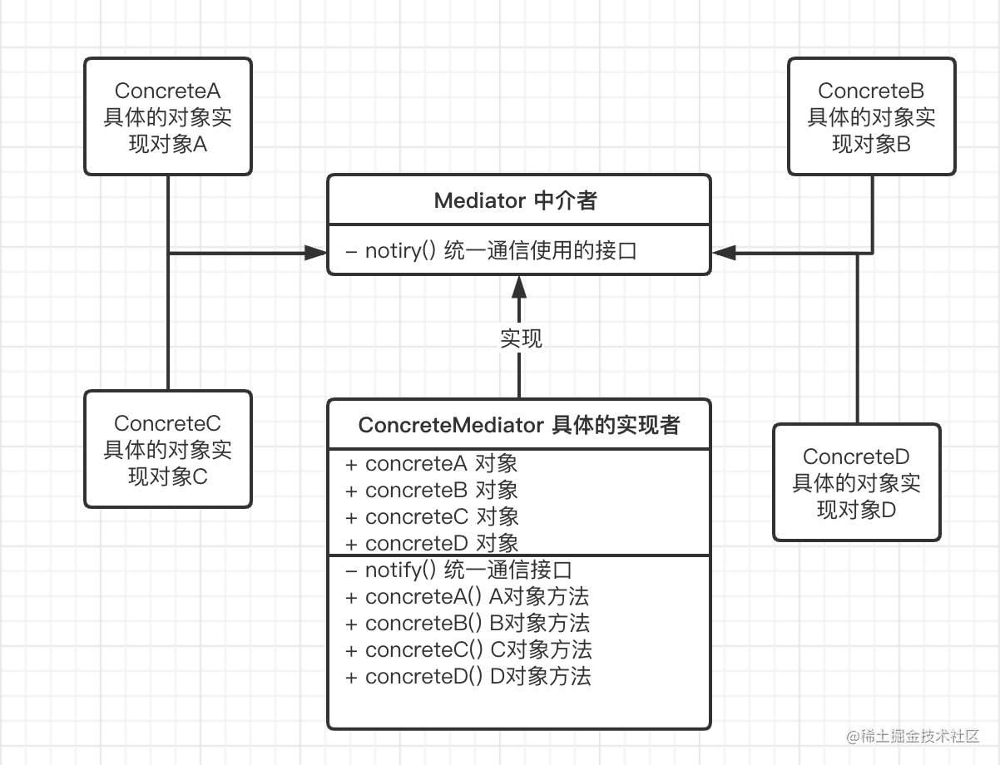

## 中介者模式

### 定义

> **定义一个封装了对象间交互关系的对象**

### 使用场景

- 避免一组相互交互的对象之间出现紧耦合。
- 能够独立地改变一组对象之间的交互关系而不影响其他对象

### UML图



### 实例

我们还是使用最经典的租房子的案例。

首先是中介者的接口，中介者的接口需要由需要进行通信的子类实现，这里定义了租房的联络接口

```JAVA
public abstract class Mediator { //中介者
    //申明一个联络方法
    public abstract void constact(String message,Person person);
}
```

用户类，内部嵌入了联络的对象，使得子类可以和任意对象进行通信

```java
public abstract class Person {
    protected String name;
    protected Mediator mediator;
    
    Person(String name,Mediator mediator){
        this.name = name;
        this.mediator = mediator;
    }
    
}
```

房东类，继承Person类的同时，实现自己的通信方法

```java
public class HouseOwner extends Person{

    HouseOwner(String name, Mediator mediator) {
        super(name, mediator);
    }
    
    /**
     * @desc 与中介者联系
     * @param message
     * @return void
     */
    public void constact(String message){
        mediator.constact(message, this);
    }

    /**
     * @desc 获取信息
     * @param message
     * @return void
     */
    public void getMessage(String message){
        System.out.println("房主:" + name +",获得信息：" + message);
    }
}
```

下面是另一个Person类，也就是中介者的对象，负责和房东进行通信

```java
public class Tenant extends Person{
    
    Tenant(String name, Mediator mediator) {
        super(name, mediator);
    }
    
    /**
     * @desc 与中介者联系
     * @param message
     * @return void
     */
    public void constact(String message){
        mediator.constact(message, this);
    }

    /**
     * @desc 获取信息
     * @param message
     * @return void
     */
    public void getMessage(String message){
        System.out.println("租房者:" + name +",获得信息：" + message);
    }
}
```

下面是具体的中介对象，可以看到下面定义了房东的的信息以及租房者的对象，通过中介对象，我们实现了房东和房客之间的通信，让他们统一通过中介机构进行通信。

```java
public class MediatorStructure extends Mediator{
    //首先中介结构必须知道所有房主和租房者的信息
    private HouseOwner houseOwner;
    private Tenant tenant;

    public HouseOwner getHouseOwner() {
        return houseOwner;
    }

    public void setHouseOwner(HouseOwner houseOwner) {
        this.houseOwner = houseOwner;
    }

    public Tenant getTenant() {
        return tenant;
    }

    public void setTenant(Tenant tenant) {
        this.tenant = tenant;
    }

    public void constact(String message, Person person) {
        if(person == houseOwner){          //如果是房主，则租房者获得信息
            tenant.getMessage(message);
        }
        else{       //反正则是房主获得信息
            houseOwner.getMessage(message);
        }
    }
}
```

最后是客户端的代码，可以看到通过中介的形式，可以实现中介和房东一对一，以及租房者和中介一对一的解耦合的形式.

```java
public class Client {
    public static void main(String[] args) {
        //一个房主、一个租房者、一个中介机构
        MediatorStructure mediator = new MediatorStructure();
        
        //房主和租房者只需要知道中介机构即可
        HouseOwner houseOwner = new HouseOwner("张三", mediator);
        Tenant tenant = new Tenant("李四", mediator);
        
        //中介结构要知道房主和租房者
        mediator.setHouseOwner(houseOwner);
        mediator.setTenant(tenant);
        
        tenant.constact("听说你那里有三室的房主出租.....");
        houseOwner.constact("是的!请问你需要租吗?");
    }
}
```

### 优缺点

优点

- 将对象的交互模式由多对一变为一对一
- 可以实现多个类之间的强耦合。
- 此设计模式十分符合迪米特原则。

缺点

- 中介者对象会逐渐庞大，如果组件过多会变得复杂难以维护。

  


### 问题

2022-11-20日

### **代理模式、外观模式和中介者模式对比**

> #### **代理模式和中介者模式**
>
> 代理模式是结构型设计模式，它有很多种类型，主要是在访问对象时引入一定程度的间接性，由于有间接性，就可以附加多种的用途，比如进行权限控制。中介者模式则是为了减少对象之间的相互耦合。虽然网上有很多代理模式和中介者模式的对比，但是在我看来这两者实际上并没有可比性，只是看起来有些类似罢了。
>
> #### **外观模式和中介者模式**
>
> 外观模式主要是以封装和隔离为主要任务，中介者则是调停同事类之间的关系，因此，中介者具有部分业务的逻辑控制。他们之间的主要区别为：
>
> - 外观模式的子系统如果脱离外观模式还是可以运行的，而中介者模式增加了业务逻辑，同事类不能脱离中介者而独自存在。
> - 外观模式中，子系统是不知道外观类的存在的，而中介者模式中，每个同事类都知道中介者。
> - 外观模式将子系统的逻辑隐藏，用户不知道子系统的存在，而中介者模式中，用户知道同事类的存在。


参考:

[设计模式（十四）中介者模式 - 简书 (jianshu.com)](https://www.jianshu.com/p/c56fc402e11d)

[浅谈设计模式 - 中介者模式（十六） - 掘金 (juejin.cn)](https://juejin.cn/post/7023978397730603039#heading-4)