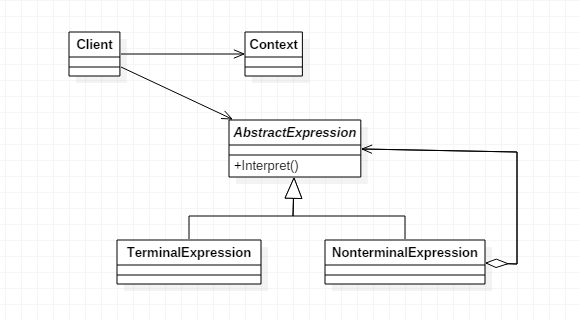

## 解释器模式

### 定义

> 给定一个语言，定义它的文法表示，并定义一个解释器，这个解释器使用该标识来解释语言中的句子。

### 使用场景

只有在**特定领域**才会用到，如编译器、规则引擎、正则表达式、SQL等，而这类语言又称 **领域特定语言** (Domain Specific Language, **DSL**)。

### UML



### 实例

```csharp
public abstract class Expression {
    /**
     * 以环境为准，本方法解释给定的任何一个表达式
     */
    public abstract int interpret(Context ctx);
    /**
     * 检验两个表达式在结构上是否相同
     */
    public abstract boolean equals(Object obj);
    /**
     * 返回表达式的hash code
     */
    public abstract int hashCode();
    /**
     * 将表达式转换成字符串
     */
    public abstract String toString();
}
```

因为需要解释加法和减法，因此实现类也有Plus和Minus两个非终结符表达式

```swift
public class Plus extends Expression {

    private Expression left,right;
    
    public Plus(Expression left , Expression right){
        this.left = left;
        this.right = right;
    }
    @Override
    public boolean equals(Object obj) {
        if(obj != null && obj instanceof Plus)
        {
            return left.equals(((Plus)obj).left) &&
                right.equals(((Plus)obj).right);
        }
        return false;
    }

    @Override
    public int hashCode() {
        return this.toString().hashCode();
    }

    @Override
    public int interpret(Context ctx) {
        
        return left.interpret(ctx) + right.interpret(ctx);
    }

    @Override
    public String toString() {
        return "(" + left.toString() + " + " + right.toString() + ")";
    }

}

public class Minus extends Expression {
    
    private Expression left, right;

    public Minus(Expression left, Expression right) {
        this.left = left;
        this.right = right;
    }

    @Override
    public boolean equals(Object obj) {
        if (obj != null && obj instanceof Minus) {
            return left.equals(((Minus) obj).left) && right.equals(((Minus) obj).right);
        }
        return false;
    }

    @Override
    public int hashCode() {
        return this.toString().hashCode();
    }

    @Override
    public int interpret(Context ctx) {

        return left.interpret(ctx) - right.interpret(ctx);
    }

    @Override
    public String toString() {
        return "(" + left.toString() + " - " + right.toString() + ")";
    }
}
```

除此之外我们还需要变量与常量两个终结符表达式

```java
public class Constant extends Expression{
    
    private int value;

    public Constant(int value){
        this.value = value;
    }
    
    @Override
    public boolean equals(Object obj) {
        
        if(obj != null && obj instanceof Constant){
            return this.value == ((Constant)obj).value;
        }
        return false;
    }

    @Override
    public int hashCode() {
        return this.toString().hashCode();
    }

    @Override
    public int interpret(Context ctx) {
        
        return value;
    }

    @Override
    public String toString() {
        return new Integer(value).toString();
    }
    
}

public class Variable extends Expression {

    private String name;

    public Variable(String name){
        this.name = name;
    }
    @Override
    public boolean equals(Object obj) {
        
        if(obj != null && obj instanceof Variable)
        {
            return this.name.equals(
                    ((Variable)obj).name);
        }
        return false;
    }

    @Override
    public int hashCode() {
        return this.toString().hashCode();
    }

    @Override
    public String toString() {
        return name;
    }

    @Override
    public int interpret(Context ctx) {
        return ctx.lookup(this);
    }

}
```

环境角色基本可以存放文法中各个终结符所对应的具体值，下面的类就是用一个map来负责

```csharp
public class Context {

    private Map<Variable,Integer> map = new HashMap<Variable,Integer>();
    
    public void assign(Variable var , int value){
        map.put(var, new Integer(value));
    }
    
    public int lookup(Variable var) throws IllegalArgumentException{
        Integer value = map.get(var);
        if(value == null){
            throw new IllegalArgumentException();
        }
        return value.intValue();
    }
}
```

Client客户端的代码

```cpp
public class Client {

    public static void main(String[] args) {
        Context ctx = new Context();
        Variable x = new Variable("x");
        Variable y = new Variable("y");
        Constant c = new Constant(1);
        ctx.assign(x, 2);
        ctx.assign(y, 3);
        
        Expression exp = new Plus(new Plus(c,x) , new Minus(y,x));
        System.out.println(exp.toString() + "=" + exp.interpret(ctx));
    }
}
((1 + x) + (y - x))=4
```

### 优缺点

优点

扩展性,修改语法规则只需要修改相应的非终结符就可以了。

缺点

类会很多，会造成类膨胀。