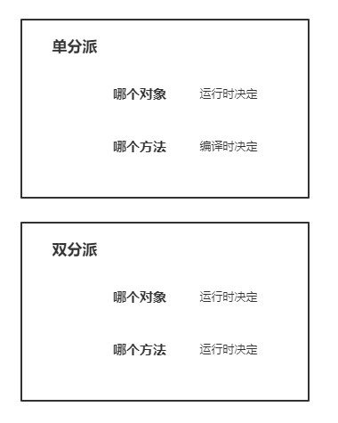

## 访问者模式

### 定义

> 封装一些作用于某种数据结构中的各元素的操作，它可以在不改变这个数据结构的前提下定义作用于其内部各个元素的新操作

这是最难理解的设计模式，也是最不常用的设计模式。

### 使用场景

1. 对象结构比较稳定，但经常需要在此对象结构上定义新的操作。
2. 需要对一个对象结构中的对象进行很多不同的并且不相关的操作，而需要避免这些操作“污染”这些对象的类，也不希望在增加新操作时修改这些类。

### UML图


- **Visitor**：接口或者抽象类，定义了对每个 Element 访问的行为，它的参数就是被访问的元素，它的方法个数理论上与元素的个数是一样的，因此，访问者模式要求元素的类型要稳定，如果经常添加、移除元素类，必然会导致频繁地修改 Visitor 接口，如果出现这种情况，则说明不适合使用访问者模式。
- **ConcreteVisitor**：具体的访问者，它需要给出对每一个元素类访问时所产生的具体行为。
- **Element**：元素接口或者抽象类，它定义了一个接受访问者（accept）的方法，其意义是指每一个元素都要可以被访问者访问。
- **ElementA、ElementB**：具体的元素类，它提供接受访问的具体实现，而这个具体的实现，通常情况下是使用访问者提供的访问该元素类的方法。
- **ObjectStructure**：定义当中所提到的对象结构，对象结构是一个抽象表述，它内部管理了元素集合，并且可以迭代这些元素提供访问者访问。

**分派**

首先，我们需要理解什么叫分派。分派是什么样的概念呢？分派即Dispatch，在面向对象编程语言中，我们可以把方法调用理解为一种消息传递（Dispatch）。一个对象调用另一个对象的方法，相当于给被调用对象发送一个消息，这个消息包括对象名、方法名、方法参数等信息。

### 单分派

单分派，即执行哪个对象的方法，根据对象的运行时类型决定；执行对象的哪个方法，根据方法参数的**编译时**类型决定。

### 双分派

双分派，即执行哪个对象的方法，根据对象的运行时类型决定；执行对象的哪个方法，根据方法参数的**运行时**的类型来决定。

听起来似乎很绕口，其实很简单，下面以表格的形式展示，可能会更加明了一点。



分派机制如果在是在编程语言中，单分派和双分派就是跟多态和函数重载直接相关。那Java是属于单分派还是双分派呢？我们直接用个代码示例在验证好了。

```java
public class Parent {
    public void call() {
        System.out.println("I'm Parent.");
    }
}
```

```java
public class Child extends Parent {
    public void call() {
        System.out.println("I'm Child.");
    }
}
```

```java
public class App {
    public void call(Parent parent) {
        parent.call();
    }
    public  void sayName(Parent parent) {
        System.out.println("saveName重载，参数类型： Parent");
    }
    public  void sayName(Child child) {
        System.out.println("saveName重载，参数类型： Child");
    }
    public static void main(String[] args) {
        App app = new App();
        Parent obj = new Child();
        app.call(obj);
        app.sayName(obj);
    }
}
输出:
I'm Child.
saveName重载，参数类型： Parent
Process finished with exit code 0
```

new对象时，我们new的是Child对象，通过call方法的调用结果可知，最终打印出的是"I'm Child."，即App类的call方法中，到底调用Parent的call还是会调用Child的call，由我们创建的对象实例类型决定，是运行时决定的，正所谓多态；而通过saveName方法的调用结果可知，尽管我们new的是Child对象，结果调用的却是形参类型是Parent的那个重载，由此可知，这里决定调用那个saveName重载，在编译时就决定了。所以，很明显了，**Java支持单分派，不支持多分派**。

也因此得知，Java语言中的函数重载，并不是在运行时，根据传递给函数的参数的实际类型，来决定调用哪个重载函数，而是在编译时，根据传递给函数的参数的声明类型，来决定调用哪个重载函数。即Java语言中，**多态是一种动态绑定，函数重载是一种静态绑定**。

正因为在某些编程语言中，如Java不支持双分派，所以访问者设计模式诞生了。

### 实例

年底，CEO和CTO开始评定员工一年的工作绩效，员工分为工程师和经理，CTO关注工程师的代码量、经理的新产品数量；CEO关注的是工程师的KPI和经理的KPI以及新产品数量。
由于CEO和CTO对于不同员工的关注点是不一样的，这就需要对不同员工类型进行不同的处理。访问者模式此时可以派上用场了。

```java
// 员工基类
public abstract class Staff {    
	public String name;
    public int kpi;// 员工KPI

    public Staff(String name) {
        this.name = name;
        kpi = new Random().nextInt(10);
    }
    // 核心方法，接受Visitor的访问
    public abstract void accept(Visitor visitor);
}
```

Staff 类定义了员工基本信息及一个 accept 方法，accept 方法表示接受访问者的访问，由子类具体实现。Visitor 是个接口，传入不同的实现类，可访问不同的数据。下面看看工程师和经理的代码：

```java
// 工程师
    public class Engineer extends Staff {
    public Engineer(String name) {
        super(name);
    }

    @Override
    public void accept(Visitor visitor) {
        visitor.visit(this);
    }
    // 工程师一年的代码数量
    public int getCodeLines() {
        return new Random().nextInt(10 * 10000);
    }
}
```

```java

}// 经理
public class Manager extends Staff {
    public Manager(String name) {
        super(name);
    }

    @Override
    public void accept(Visitor visitor) {
        visitor.visit(this);
    }
    // 一年做的产品数量
    public int getProducts() {
        return new Random().nextInt(10);
    }
}
```

工程师是代码数量，经理是产品数量，他们的职责不一样，也就是因为差异性，才使得访问模式能够发挥它的作用。Staff、Engineer、Manager 3个类型就是对象结构，这些类型相对稳定，不会发生变化。

然后将这些员工添加到一个业务报表类中，公司高层可以通过该报表类的 showReport 方法查看所有员工的业绩，具体代码如下：

```java
// 员工业务报表类
public class BusinessReport {
    private List<Staff> mStaffs = new LinkedList<>();

    public BusinessReport() {
        mStaffs.add(new Manager("经理-A"));
        mStaffs.add(new Engineer("工程师-A"));
        mStaffs.add(new Engineer("工程师-B"));
        mStaffs.add(new Engineer("工程师-C"));
        mStaffs.add(new Manager("经理-B"));
        mStaffs.add(new Engineer("工程师-D"));
    }
    /**
     * 为访问者展示报表
     * @param visitor 公司高层，如CEO、CTO
     */
    public void showReport(Visitor visitor) {
        for (Staff staff : mStaffs) {
            staff.accept(visitor);
        }
    }
}
```

下面看看 Visitor 类型的定义， Visitor 声明了两个 visit 方法，分别是对工程师和经理对访问函数，具体代码如下：

```java
public interface Visitor {
    // 访问工程师类型
    void visit(Engineer engineer);

    // 访问经理类型
    void visit(Manager manager);
}
```

首先定义了一个 Visitor 接口，该接口有两个 visit 函数，参数分别是 Engineer、Manager，也就是说对于 Engineer、Manager 的访问会调用两个不同的方法，以此达成区别对待、差异化处理。具体实现类为 CEOVisitor、CTOVisitor类，具体代码如下：


```java
// CEO访问者
public class CEOVisitor implements Visitor {
    @Override
    public void visit(Engineer engineer) {
        System.out.println("工程师: " + engineer.name + ", KPI: " + engineer.kpi);
    }

    @Override
    public void visit(Manager manager) {
        System.out.println("经理: " + manager.name + ", KPI: " + manager.kpi +
                ", 新产品数量: " + manager.getProducts());
    }
}
```

在CEO的访问者中，CEO关注工程师的 KPI，经理的 KPI 和新产品数量，通过两个 visitor 方法分别进行处理。如果不使用 Visitor 模式，只通过一个 visit 方法进行处理，那么就需要在这个 visit 方法中进行判断，然后分别处理，代码大致如下：

```java
public class ReportUtil {
    public void visit(Staff staff) {
        if (staff instanceof Manager) {
            Manager manager = (Manager) staff;
            System.out.println("经理: " + manager.name + ", KPI: " + manager.kpi +
                    ", 新产品数量: " + manager.getProducts());
        } else if (staff instanceof Engineer) {
            Engineer engineer = (Engineer) staff;
            System.out.println("工程师: " + engineer.name + ", KPI: " + engineer.kpi);
        }
    }
}
```

这就导致了 if-else 逻辑的嵌套以及类型的强制转换，难以扩展和维护，当类型较多时，这个 ReportUtil 就会很复杂。而使用 Visitor 模式，通过同一个函数对不同对元素类型进行相应对处理，使结构更加清晰、灵活性更高。
再添加一个CTO的 Visitor 类：

```java
public class CTOVisitor implements Visitor {
    @Override
    public void visit(Engineer engineer) {
        System.out.println("工程师: " + engineer.name + ", 代码行数: " + engineer.getCodeLines());
    }

    @Override
    public void visit(Manager manager) {
        System.out.println("经理: " + manager.name + ", 产品数量: " + manager.getProducts());
    }
}
```

重载的 visit 方法会对元素进行不同的操作，而通过注入不同的 Visitor 又可以替换掉访问者的具体实现，使得对元素的操作变得更灵活，可扩展性更高，同时也消除了类型转换、if-else 等“丑陋”的代码。
下面是客户端代码：

```java
public class Client {

    public static void main(String[] args) {
        // 构建报表
        BusinessReport report = new BusinessReport();
        System.out.println("=========== CEO看报表 ===========");
        report.showReport(new CEOVisitor());
        System.out.println("=========== CTO看报表 ===========");
        report.showReport(new CTOVisitor());
    }
}
```

```java

=========== CEO看报表 ===========
经理: 经理-A, KPI: 9, 新产品数量: 0
工程师: 工程师-A, KPI: 6
工程师: 工程师-B, KPI: 6
工程师: 工程师-C, KPI: 8
经理: 经理-B, KPI: 2, 新产品数量: 6
工程师: 工程师-D, KPI: 6
=========== CTO看报表 ===========
经理: 经理-A, 产品数量: 3
工程师: 工程师-A, 代码行数: 62558
工程师: 工程师-B, 代码行数: 92965
工程师: 工程师-C, 代码行数: 58839
经理: 经理-B, 产品数量: 6
工程师: 工程师-D, 代码行数: 53125

```


访问者模式最大的优点就是增加访问者非常容易，我们从代码中可以看到，如果要增加一个访问者，只要新实现一个 Visitor 接口的类，从而达到数据对象与数据操作相分离的效果。如果不实用访问者模式，而又不想对不同的元素进行不同的操作，那么必定需要使用 if-else 和类型转换，这使得代码难以升级维护。


### 优缺点

优点

- 使得给结构稳定的对象增加新算法变得容易，提搞了代码的可维护性，可扩展性。

缺点

- 太复杂，特别是伪动态双分派，不仔细理解很难想清楚。


参考:[(56条消息) 访问者模式(Visitor Pattern)的使用场景_zhuyutong202的博客-CSDN博客](https://blog.csdn.net/zhuyutong202/article/details/114242140)