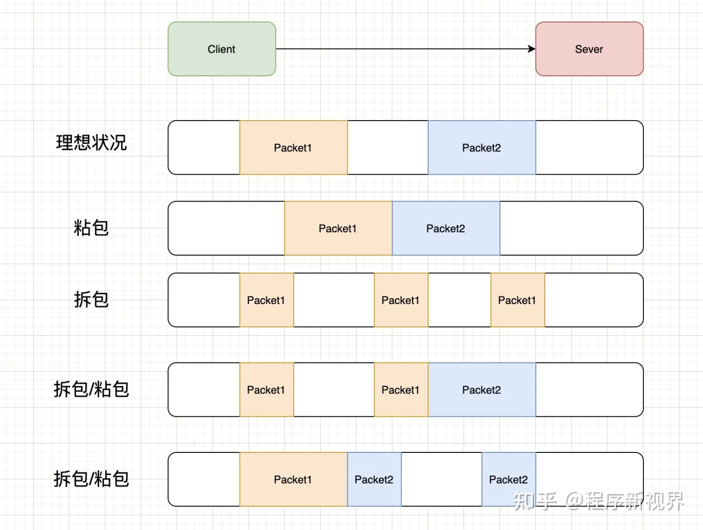

### TCP和UDP的区别

> 1. TCP需要先建立连接，UDP是无连接的
> 2. TCP保证可靠传输，UDP尽最大努力交付
> 3. TCP面向字节流，UDP面向报文
> 4. TCP有拥塞控制，UDP没有，数据生成速率只跟网络状态有关
> 5. 每一条TCP连接只能是点到点的；而UDP支持一对一，一对多，多对一和多对多的交互通信

### TCP三次握手

>1. 客户端向服务端发送一个SYN
>2. 服务端接收到SYN后，给客户端发送一个SYN_ACK
>3. 客户端接收到SYN_ACK后，再给服务端发送一个ACK
>
>当然，问题不会问的这么简单，有些面试官会问，为什么不能两次握手？
>
>首先少了三次握手，就不能保证可靠连接的建立，第一次服务端确认了客户端的传输能力，第二次客户端确认了服务端的接收能力和发送能力，第三次服务端确认了客户端的接收能力。三次功能都不一样。

### TCP四次挥手

> 1. 客户端向服务端发送FIN
> 2. 服务端接收FIN后，向客户端发送ACK，表示我接收到了断开连接的请求，客户端你可以不发数据了，不过服务端这边可能还有数据正在处理
> 3. 服务端处理完所有数据后，向客户端发送FIN，表示服务端现在可以断开连接
> 4. 客户端收到服务端的FIN，向服务端发送ACK，表示客户端也会断开连接了
>
> 同理，无情追问：为什么不能三次挥手
>
> 这边我是这么理解的，因为第一次和第四次都是确认，所以如果压缩的话，只能将二三次挥手合并。第二次挥手主要是为了让客户端知道服务端这边知道了你要断开连接了，但是手头上还有数据没处理完。处理完之后才会发第三次断开请求。如果合并，那么等数据处理完之后才理客户端，会导致客户端发出第一个请求后，收不到信息，以为自己没发出去信息，就会进行TCP重发，浪费资源。

### SYN泛洪攻击

> syn洪泛攻击是Dos攻击的一种，服务器端的资源分配是在二次握手时分配的，而客户端的资源是在完成三次握手时分配的，所以服务器容易受到SYN洪泛攻击，SYN攻击就是Client在短时间内伪造大量不存在的IP地址，并向Server不断地发送SYN包，Server则回复SYN+ACK确认包，并等待Client确认回复ACK,而这些大量的IP是不存在的，并不会向服务端发送ack确认包，所以会大量的占领半连接队列资源，导致正常的SYN请求因为队列满而被丢弃，从而引起网络拥塞甚至系统瘫痪。
>
> 
>
> 主要三种方式防御:
>
> 1、降低SYN timeout时间，使得主机尽快释放半连接的占用
> 2、采用SYN cookie设置，如果短时间内连续收到某个IP的重复SYN请求，则认为受到了该IP的攻击，丢弃来自该IP的后续请求报文
> 3、在网关处设置过滤，拒绝将一个源IP地址不属于其来源子网的包进行更远的路由

### TCP的粘包和拆包问题，如何解决？

> 粘包:TCP协议中，发送方发送的若干包数据到接收方接收时粘成一包，从接收缓冲区看，后一包数据的头紧接着前一包数据的尾。
>
> TCP是面向字节流的协议，就是没有界限的一串数据，本没有“包”的概念，“粘包”和“拆包”一说是为了有助于形象地理解这两种现象。
>
> ### 粘包拆包发生场景
>
> 因为TCP是面向流，没有边界，而操作系统在发送TCP数据时，会通过缓冲区来进行优化，例如缓冲区为1024个字节大小。
>
> 如果一次请求发送的数据量比较小，没达到缓冲区大小，TCP则会将多个请求合并为同一个请求进行发送，这就形成了粘包问题。
>
> 如果一次请求发送的数据量比较大，超过了缓冲区大小，TCP就会将其拆分为多次发送，这就是拆包。
>
> 
>
> 上图中演示了以下几种情况：
>
> - 正常的理想情况，两个包恰好满足TCP缓冲区的大小或达到TCP等待时长，分别发送两个包；
> - 粘包：两个包较小，间隔时间短，发生粘包，合并成一个包发送；
> - 拆包：一个包过大，超过缓存区大小，拆分成两个或多个包发送；
> - 拆包和粘包：Packet1过大，进行了拆包处理，而拆出去的一部分又与Packet2进行粘包处理。
>
> ### 常见的解决方案
>
> 对于粘包和拆包问题，常见的解决方案有四种：
>
> - 发送端将每个包都封装成固定的长度，比如100字节大小。如果不足100字节可通过补0或空等进行填充到指定长度；
> - 发送端在每个包的末尾使用固定的分隔符，例如\r\n。如果发生拆包需等待多个包发送过来之后再找到其中的\r\n进行合并；例如，FTP协议；
> - 将消息分为头部和消息体，头部中保存整个消息的长度，只有读取到足够长度的消息之后才算是读到了一个完整的消息；
> - 通过自定义协议进行粘包和拆包的处理。

### 为什么UDP没有粘包？

> 粘包拆包问题在数据链路层、网络层以及传输层都有可能发生。日常的网络应用开发大都在传输层进行，由于UDP有消息保护边界，不会发生粘包拆包问题，因此粘包拆包问题只发生在TCP协议中。

### TCP拥塞控制

> 首先拥塞就是网络中对某一资源的需求大于了可提供的部分。主要原因就是：接收方容量不够等。但是如果只有重传，只会导致网络的负担更重，会导致更大的延迟和丢包。可能造成网络风暴。
>
> 为了防止过多的数据注入网络或者丢失数据，TCP实行拥塞控制。
>
> - **慢启动阶段思路**是不要一开始就发送大量的数据，先探测一下网络的拥塞程度，也就是说由小到大逐渐增加拥塞窗口的大小，在没有出现丢包时每收到一个 ACK 就将拥塞窗口大小加一（单位是 MSS，最大单个报文段长度），每轮次发送窗口增加一倍，呈指数增长，若出现丢包，则将拥塞窗口减半，进入**拥塞避免**阶段；
> - 当窗口达到慢启动阈值或出现丢包时，进入**拥塞避免**阶段，窗口每轮次加一，呈线性增长；当收到对一个报文的三个重复的 ACK 时，认为这个报文的下一个报文丢失了，进入**快重传**阶段，要求接收方在收到一个失序的报文段后就立即发出重复确认（为的是使发送方及早知道有报文段没有到达对方，可提高网络吞吐量约20%）而不要等到自己发送数据时捎带确认；
> - **快重传**完成后进入**快恢复**阶段，将慢启动阈值修改为当前拥塞窗口值的一半，同时拥塞窗口值等于慢启动阈值，然后进入拥塞避免阶段，重复上述过程。
