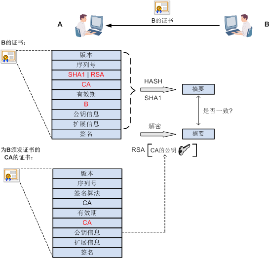

### cookie是存在报文头还是报文体里面？

> 都是请求头里面。

### 数字证书

> #### 为什么会有证书这个概念呢？
>
> 主要是在非对称加密中，客户端需要获取服务端的公钥信息，但是如果请求被第三方拦截的话，公钥信息就可能被替换，会导致客户端用第三方的公钥进行加密，交互信息存在泄露的风险（谁也不想自己的银行卡密码被泄露）。因此，引入证书，用于鉴别服务端的身份。如果服务端的身份鉴定失败，那么就终止请求。
>
> #### 那么证书的原理是什么呢？
>
> 证书颁发给使用者后，使用者就会拿着证书到处证明自己的身份。如果我们收到了一个这样的证书，怎么才能判断这个证书就是合法的，不是伪造的呢？证书中存储的有签名信息，假设交互的双方是A和B。A收到了B发过来的证书，想要验证这个证书的真伪，通过如下步骤：
>
> 1. A首先需要获取到为B颁发证书的那个CA的公钥，用这个公钥解密证书中的签名，得到摘要信息1
>
> 2. A使用证书中签名算法里面的HASH算法对证书进行HASH计算，得到一个摘要信息2。
>
> 3. A将摘要信息1和摘要信息2进行对比，如果两者一致，就说明证书确实是由这个CA颁发的（能用CA的公钥解密说明该CA确实持有私钥），并且没有被篡改过，该证书没有问题。
>
> 当然，也会同时检查证书是否在有效期内。
>
> #### 上述过程存在两个问题：
>
> 1. CA的公钥如何获取
>
> 2. 如何验证CA的证书是否被篡改及身份
>
> 对于问题1：B的证书中含有为B颁发证书的CA的信息，A通过该信息请求CA的证书，CA的证书中含有CA的公钥。
>
> 对于问题2：验证CA证书是否被篡改及CA的身份和A验证B的证书和身份的原理一样，首先通过摘要信息进行判断，然后找为CA颁发证书的上层CA，通过这种一层一层的方式验证身份。那么，什么时候这个验证过程才会停止呢？直到找到一个可信的CA或者验证出现了错误。操作系统中一般都会安装一些根证书，在进行身份验证的时候，如果在操作系统的根证书中验证了CA的身份，那么验证过程就可以终止了。
>
> 
