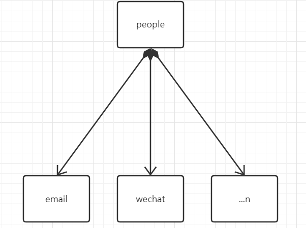
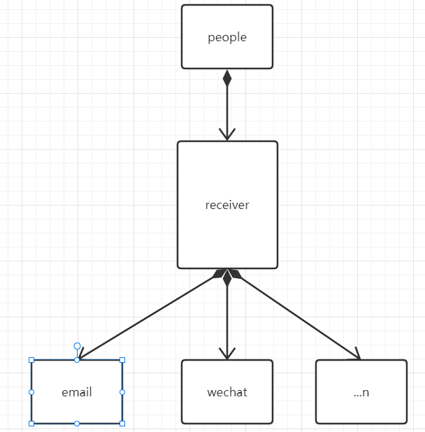

## 设计模式依赖倒置原则

### 别称

依赖倒转原则， 也叫 Dependency Inversion Principle, DIP。

### 定义

依赖倒置原则是说抽象不应该依赖于细节，细节应当依赖于抽象。也就是要针对接口编程，而不是针对实现编程。

### 说明

依赖倒转原则要求我们在程序代码中传递参数时或在关联关系中，尽量引用层次高的抽象层类，即使用接口和抽象类进行变量类型声明、参数类型声明、方法返回类型声明，以及数据类型的转换等，而不要用具体类来做这些事情。

为了确保该原则的应用，一个具体类应当只实现接口或抽象类中声明过的方法，而不要给出多余的方法，否则将无法调用到在子类中增加的新方法。

在引入抽象层后，系统将具有很好的灵活性，在程序中尽量使用抽象层进行编程，而将具体类写在配置文件中，这样一来，如果系统行为发生变化，只需要对抽象层进行扩展，并修改配置文件，而无须修改原有系统的源代码，在不修改的情况下来扩展系统的功能，满足开闭原则的要求。

### 原则

在实现依赖倒转原则时，我们需要针对抽象层编程，而将具体类的对象通过 **依赖注入** 的方式注入到其他对象中。

依赖注入是指当一个对象要与其他对象发生依赖关系时，通过抽象来注入所依赖的对象。

最简单的例子就是

假设有个人类，有个获取信息的功能。

以前大家都用短信来发信息,然后后来有了微信，如图

后来，又多了n种方法。。。

人这个类是不是要写一堆接收方法。。。

但是如果我们抽象一层，将发信息抽象起来，然后人只需要写一个接收方法，参数是接口就可以。可以非常节约代码量。

